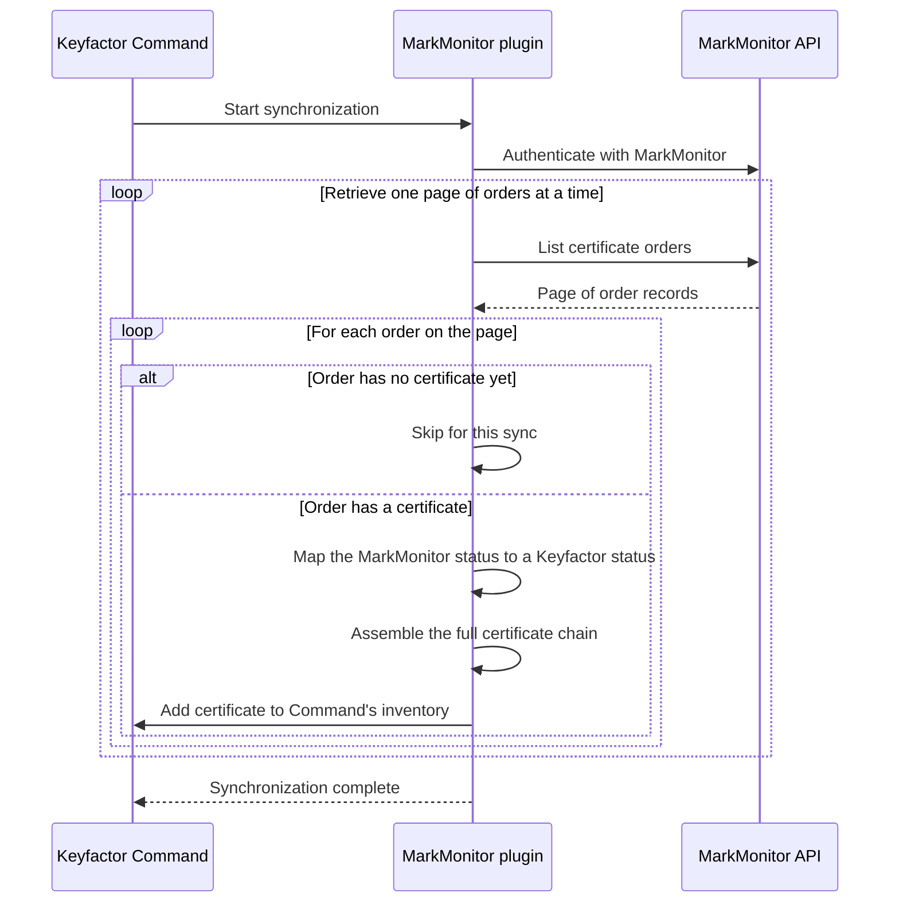
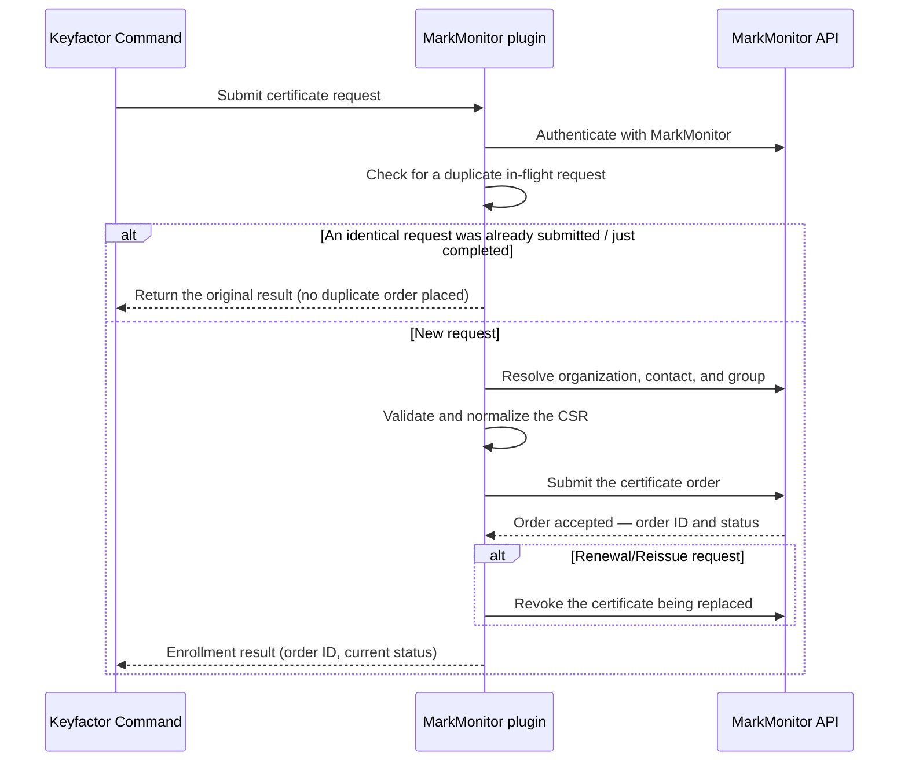
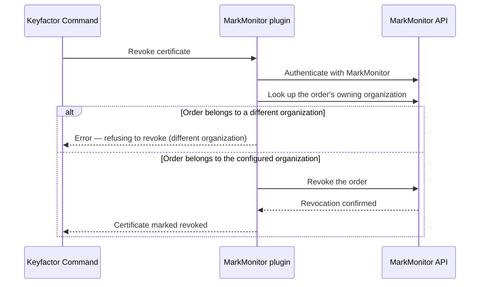
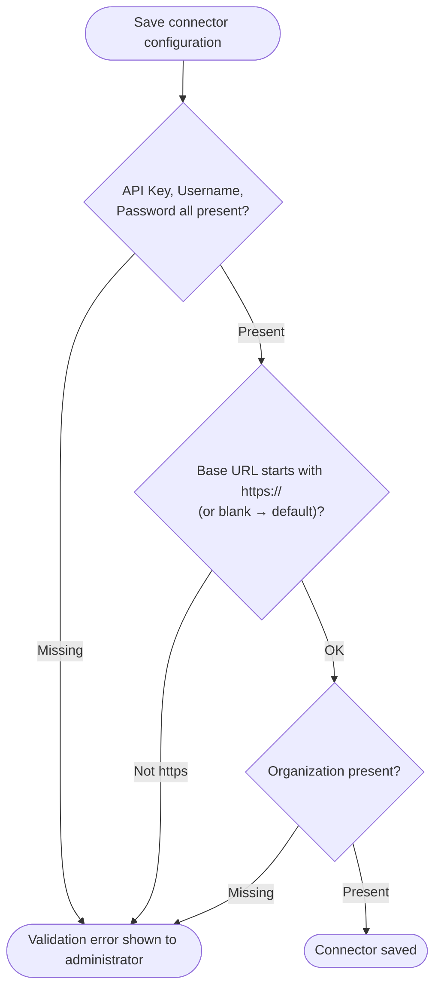

<h1 align="center" style="border-bottom: none">
    Markmonitor AnyCA Gateway REST Plugin
</h1>

<p align="center">
  <!-- Badges -->

<a href="https://github.com/Keyfactor/markmonitor-caplugin/releases"></a>


</p>

<p align="center">
  <!-- TOC -->
  <a href="#support">
    <b>Support</b>
  </a>
  ·
  <a href="#requirements">
    <b>Requirements</b>
  </a>
  ·
  <a href="#installation">
    <b>Installation</b>
  </a>
  ·
  <a href="#license">
    <b>License</b>
  </a>
  ·
  <a href="https://github.com/orgs/Keyfactor/repositories?q=anycagateway">
    <b>Related Integrations</b>
  </a>
</p>

The MarkMonitor AnyCA Gateway REST plugin extends the certificate lifecycle capabilities of the
MarkMonitor SSL certificate service to Keyfactor Command via the Keyfactor AnyCA Gateway REST. It
implements `IAnyCAPlugin` and is loaded as a DLL extension by the AnyCA Gateway REST host process —
it is not a standalone service. The plugin supports the following capabilities:

* CA Synchronization:
    * Downloads all certificate orders visible to the configured MarkMonitor organization and
      imports the issued certificates (and their chains) into Keyfactor Command.
    * Orders that have not yet produced a certificate are mapped to the appropriate pending/failed
      status rather than imported as certificates.
* Certificate Enrollment for the SSL product types MarkMonitor exposes:
    * Submits a new MarkMonitor certificate order per product type.
    * A process-local dedup guard prevents Keyfactor Command retries from creating duplicate orders.
* Renewal / Reissue:
    * MarkMonitor has no in-place "renew" enrollment endpoint through this plugin, so a
      `RenewOrReissue` enrollment places a **new** order and then revokes the prior certificate once
      the replacement has been created successfully.
* Certificate Revocation:
    * Revokes a previously issued certificate, with a cross-organization ownership check that refuses
      to revoke an order belonging to a different organization than the one the CA connector is
      configured for.

MarkMonitor's SSL API is backed by DigiCert (the only certificate `provider` its API currently
supports), so issued certificates chain up to DigiCert roots.

## Compatibility

The Markmonitor AnyCA Gateway REST plugin is compatible with the Keyfactor AnyCA Gateway REST 25.5.0 and later.

## Support
The Markmonitor AnyCA Gateway REST plugin is supported by Keyfactor for Keyfactor customers. If you have a support issue, please open a support ticket via the Keyfactor Support Portal at https://support.keyfactor.com.

> To report a problem or suggest a new feature, use the **[Issues](../../issues)** tab. If you want to contribute actual bug fixes or proposed enhancements, use the **[Pull requests](../../pulls)** tab.

## Requirements

- A MarkMonitor **API Key** (contact MarkMonitor support to obtain one).
- A MarkMonitor **service account** (username and password) with permission to create certificate
  orders.
- The **organization** name or ID (GUID) the certificates will be ordered under.
- Keyfactor Command >= v12.0.0.
- AnyCA Gateway REST >= v25.5.0.
- Network connectivity from the AnyCA Gateway host to the MarkMonitor API base URL, and trust of the
  DigiCert issuing CA chain on both the gateway host and the Command server (see
  [Gateway Registration](#gateway-registration)).

## Installation

1. Install the AnyCA Gateway REST per the [official Keyfactor documentation](https://software.keyfactor.com/Guides/AnyCAGatewayREST/Content/AnyCAGatewayREST/InstallIntroduction.htm).

2. On the server hosting the AnyCA Gateway REST, download and unzip the latest [Markmonitor AnyCA Gateway REST plugin](https://github.com/Keyfactor/markmonitor-caplugin/releases/latest) from GitHub.

3. Copy the unzipped directory (usually called `net8.0` or `net10.0`) to the Extensions directory:


    ```shell
    Depending on your AnyCA Gateway REST version, copy the unzipped directory to one of the following locations:
    Program Files\Keyfactor\AnyCA Gateway\AnyGatewayREST\net8.0\Extensions
    Program Files\Keyfactor\AnyCA Gateway\AnyGatewayREST\net10.0\Extensions
    ```

    > The directory containing the Markmonitor AnyCA Gateway REST plugin DLLs (`net8.0` or `net10.0`) can be named anything, as long as it is unique within the `Extensions` directory.

4. Restart the AnyCA Gateway REST service.

5. Navigate to the AnyCA Gateway REST portal and verify that the Gateway recognizes the Markmonitor plugin by hovering over the ⓘ symbol to the right of the Gateway on the top left of the portal.

## Configuration

1. Follow the [official AnyCA Gateway REST documentation](https://software.keyfactor.com/Guides/AnyCAGatewayREST/Content/AnyCAGatewayREST/AddCA-Gateway.htm) to define a new Certificate Authority, and use the notes below to configure the **Gateway Registration** and **CA Connection** tabs:

    * **Gateway Registration**

        In order to enroll for certificates the Keyfactor Command server must trust the issuing CA chain.
        MarkMonitor's default issuing CA (`provider`) is **DigiCert** — download and import the appropriate
        certificate chain from <https://www.digicert.com/kb/digicert-root-certificates.htm> to the AnyCA
        Gateway host and Command server.
        
        Once the necessary files are copied to the appropriate locations and the AnyCA Gateway REST is up and
        running, navigate to the AnyCA Gateway REST portal and configure the CA.
        
        ### Using file path for issuing CA certificate
        
        
        ### Using Keyfactor Command certificate store for issuing CA certificate
        > **⚠️ Warning:** The cert store must already exist in Keyfactor Command.
        
        

    * **CA Connection**

        Populate using the configuration fields collected in the [requirements](#requirements) section.

        * **ApiKey** - The API Key for the MarkMonitor API
        * **Username** - Username for the MarkMonitor API service account
        * **Password** - Password for the MarkMonitor API service account
        * **BaseUrl** - The Base URL for the MarkMonitor API - Usually either https://api.markmonitor.com
        * **OrgId** - The name of the MarkMonitor Organization to use for the API calls (ex: MarkMonitor). You can also use the Organization ID in GUID format.
        * **Enabled** - Flag to Enable or Disable gateway functionality. Disabling is primarily used to allow creation of the CA prior to configuration information being available.

2. A certificate template must be created in Keyfactor Command for each MarkMonitor product type you
want to enroll. One template is required per product type (see [Product IDs](#product-ids)). Below is
an example of a template for a GeoTrust DV SSL certificate. For more on certificate product types,
contact your MarkMonitor administrator or support.


3. Follow the [official Keyfactor documentation](https://software.keyfactor.com/Guides/AnyCAGatewayREST/Content/AnyCAGatewayREST/AddCA-Keyfactor.htm) to add each defined Certificate Authority to Keyfactor Command and import the newly defined Certificate Templates.

4. In Keyfactor Command (v12.3+), for each imported Certificate Template, follow the [official documentation](https://software.keyfactor.com/Core-OnPrem/Current/Content/ReferenceGuide/Configuring%20Template%20Options.htm) to define enrollment fields for each of the following parameters:

    * **AdditionalEmails** - List of 0 or more comma separated email addresses to send the certificate to via email after generation.
    * **MarkmonitorGroup** - The name or GUID of a Markmonitor group to use for the certificate request.
    * **MarkmonitorContact** - The name or GUID of a Markmonitor contact to use for the certificate request. Will use default Markmonitor organization contact if not specified.
    * **DCVMethod** - The method to use for Domain Control Validation (DCV). Valid values are EMAIL, DNS_CNAME_TOKEN, HTTP_TOKEN, DNS_TXT_TOKEN. Default is EMAIL.
    * **comments** - Comments to attach to the MarkMonitor order. Default is "Requested via Keyfactor Command".
    * **locale** - Locale to use for the MarkMonitor order. Default is "en".
    * **provider** - The certificate provider to use for the order. Default is "DIGICERT" (currently the only provider MarkMonitor's API supports).

## MarkMonitor API Setup

MarkMonitor requires **two** credentials that are used together (there is no OAuth mode):

1. **API Key** — sent as the `X-API-KEY` header on the authentication request. Enter it in the
   `ApiKey` connector field (masked in the Command UI).
2. **Service-account username and password** — POSTed to `/auth/v1/auth/authenticate`, which returns
   a short-lived bearer token used on all subsequent calls. Enter them in the `Username` and
   `Password` connector fields (the password is masked in the UI).

Contact your MarkMonitor administrator to provision the API key and a service account with order
permissions, and to confirm the correct API base URL and organization name/ID for your environment.

## CA Connection Configuration

The following fields are presented in the AnyCA Gateway REST portal (and the Keyfactor Command
Management Portal) when creating or editing the MarkMonitor CA connector. All fields except `Enabled`
must be provided before the connector can be saved in an enabled state.


| Field | Required / Optional | Masked | Default | Description |
|---|---|---|---|---|
| `ApiKey` | Required | Yes | *(none)* | The MarkMonitor API key, sent as the `X-API-KEY` header when authenticating. |
| `Username` | Required | No | *(none)* | Username for the MarkMonitor API service account. |
| `Password` | Required | Yes | *(none)* | Password for the MarkMonitor API service account. |
| `BaseUrl` | Required | No | `https://api.markmonitor.com` | The MarkMonitor API base URL. Must start with `https://` — credentials and the bearer token are sent to it. |
| `OrgId` | Required | No | *(none)* | The MarkMonitor organization to use for API calls. Accepts either the organization **name** (e.g. `MarkMonitor`) or its **ID in GUID format**. Used to scope enrollment and to verify ownership on revoke. |
| `Enabled` | Optional | No | `true` | Enables or disables gateway functionality. Disable to allow the CA to be created before configuration information is available. |

> **Note:** Credentials are stored in Keyfactor Command's encrypted gateway configuration. `ApiKey`
> and `Password` are masked in the UI and are never written to logs by the plugin.

## Template Enrollment Parameters

Custom enrollment parameters can be added to templates in Keyfactor Command after they have been
imported from the AnyCA Gateway. **All parameters are optional** and are read case-insensitively at
enrollment time.


| Parameter | Type | Default | Description |
|---|---|---|---|
| `AdditionalEmails` | String | *(empty)* | Zero or more comma-separated email addresses that MarkMonitor will send the issued certificate to. Spaces are also treated as separators. |
| `MarkmonitorGroup` | String | *(none)* | The name or GUID of a MarkMonitor group to associate with the order. Matched by GUID or exact (case-insensitive) name against the account-wide group list. A blank or unresolved value is omitted (best-effort). |
| `MarkmonitorContact` | String | *(org default)* | The GUID, email, or `First Last` name of a MarkMonitor contact within the organization. Falls back to the organization's default contact if not specified or not resolvable. |
| `DCVMethod` | String | `EMAIL` | Domain Control Validation method. Valid values: `EMAIL`, `DNS_CNAME_TOKEN`, `HTTP_TOKEN`, `DNS_TXT_TOKEN`. An invalid value logs a warning and falls back to `EMAIL`. |
| `comments` | String | `Requested via Keyfactor Command` | Free-text comments attached to the MarkMonitor order. |
| `locale` | String | `en` | Locale for the MarkMonitor order. |
| `provider` | String | `DIGICERT` | The certificate provider for the order. `DIGICERT` is currently the only provider the MarkMonitor API supports. |

> **Note on DCV:** The plugin passes the selected `DCVMethod` to MarkMonitor but does not itself
> automate DNS/HTTP token publication. For `EMAIL` (the default), MarkMonitor falls back to the
> domain/organization's registered DCV contacts; the plugin sends an empty `dcvEmails` list.

## Product IDs

`GetProductIds()` returns the names of the `CertOrderTypes` enum. The **Product ID** column is the
value Keyfactor Command sees and stores; the plugin maps it to the **MarkMonitor cert type** string
(the enum's `[Description]`) when placing an order. Adding a new MarkMonitor product means adding an
enum member with the matching `[Description]` — not editing a separate list.

| Product ID (Command) | MarkMonitor cert type | Typical product family |
|---|---|---|
| `SslOvBasic` | `SSL_OV_BASIC` | OV SSL (basic) |
| `SslEvBasic` | `SSL_EV_BASIC` | EV SSL (basic) |
| `SslDvGeotrust` | `SSL_DV_GEOTRUST` | GeoTrust DV SSL |
| `SslDvThawte` | `SSL_DV_THAWTE` | Thawte DV SSL |
| `SslOvThawteWebserver` | `SSL_OV_THAWTE_WEBSERVER` | Thawte OV Web Server SSL |
| `SslEvThawteWebserver` | `SSL_EV_THAWTE_WEBSERVER` | Thawte EV Web Server SSL |
| `SslOvGeotrustTruebizid` | `SSL_OV_GEOTRUST_TRUEBIZID` | GeoTrust OV True BusinessID SSL |
| `SslEvGeotrustTruebizid` | `SSL_EV_GEOTRUST_TRUEBIZID` | GeoTrust EV True BusinessID SSL |
| `SslOvSecuresite` | `SSL_OV_SECURESITE` | DigiCert OV Secure Site SSL |
| `SslEvSecuresite` | `SSL_EV_SECURESITE` | DigiCert EV Secure Site SSL |
| `SslOvSecuresitePro` | `SSL_OV_SECURESITE_PRO` | DigiCert OV Secure Site Pro SSL |
| `SslEvSecuresitePro` | `SSL_EV_SECURESITE_PRO` | DigiCert EV Secure Site Pro SSL |

> **Note:** The "typical product family" column is descriptive. Which product types your MarkMonitor
> account may actually order — and any per-product required fields — depend on your account's
> entitlements. Confirm availability with your MarkMonitor administrator.

## How It Works

This section describes, at a high level, how the plugin connects Keyfactor Command's certificate
lifecycle operations to the MarkMonitor SSL certificate service.

### Component Overview

```
┌─────────────────────────────────────────────────────────┐
│                  Keyfactor Command                       │
│                                                          │
│   Certificate Enrollment  ·  Revocation  ·  Sync Jobs    │
└────────────────────────────┬─────────────────────────────┘
                             │
                    AnyCA Gateway REST
                    (plugin host process)
                             │
┌────────────────────────────▼─────────────────────────────┐
│                   The MarkMonitor plugin                  │
│                                                          │
│   Translates Keyfactor operations into MarkMonitor API   │
│   calls and maps responses back to Command's data model. │
└────────────────────────────┬─────────────────────────────┘
                             │  HTTPS · Bearer token + X-API-KEY
                             │
┌────────────────────────────▼─────────────────────────────┐
│               MarkMonitor REST API (DigiCert)            │
│                                                          │
│   /auth/v1/auth/authenticate   /certs/v1/order           │
│   /certs/v1/organization       /auth/v1/group            │
└──────────────────────────────────────────────────────────┘
```

### Synchronization

Keyfactor Command periodically synchronizes its certificate inventory with MarkMonitor. The plugin
retrieves all certificate orders visible to the configured organization, page by page, and imports
issued certificates — along with their full certificate chain — into Command.



> The current implementation always performs a full listing of orders on each sync, rather than only
> retrieving certificates that changed since the last sync. Orders that have not yet produced a
> certificate are simply skipped for that sync rather than treated as an error.

### Certificate Enrollment (including Renewal / Reissue)

When a requester submits a certificate request through Keyfactor Command, the plugin translates it
into a MarkMonitor order: it resolves the organization, contact, and (optional) group; validates and
normalizes the CSR; and submits the order. Because Domain Control Validation (and, in some
environments, manual approval) is required before issuance, a newly submitted order is typically
accepted in a pending state rather than coming back with an issued certificate right away.



MarkMonitor has no in-place "renew" enrollment endpoint through this plugin, so a Renewal/Reissue
request always places a brand-new order. Once the replacement certificate has been created
successfully, the plugin revokes the certificate it is replacing. If the certificate being replaced
can't be identified, the request is simply treated as a new issuance — a failure to revoke the old
certificate never blocks delivery of the new one.

### Revocation

When a certificate is revoked in Keyfactor Command, the plugin confirms that the target order belongs
to the organization the CA connector is configured for before calling MarkMonitor's revoke operation.



> MarkMonitor's revoke operation has no field for a revocation reason code, so the reason supplied by
> Keyfactor Command cannot be forwarded to MarkMonitor.

### Connector Validation

When an administrator saves or edits the CA connector, the plugin checks the supplied configuration
before the connector can be saved in an enabled state.



This check validates the configuration fields themselves — it does not place a live call to
MarkMonitor. Use the connector's connection test to confirm live connectivity; that test
authenticates with MarkMonitor and confirms that at least one organization is visible.

### Order Status Mapping

MarkMonitor order statuses are mapped to Keyfactor statuses as follows:

| MarkMonitor order status | Keyfactor status |
|---|---|
| `DIGI_PENDING`, `DIGI_PROCESSING`, `DIGI_REISSUE_PENDING`, `DIGI_WAITING_PICKUP`, `REISSUE_PENDING`, `DIGI_NEEDS_APPROVAL`, `REISSUE_REQUEST_PENDING` | `INPROCESS` |
| `CREATED` | `EXTERNALVALIDATION` (accepted, awaiting DCV/issuance) |
| `DIGI_ISSUED` | `GENERATED` (issued) |
| `DIGI_REVOKED` | `REVOKED` |
| `DIGI_FAILED`, `DIGI_REISSUE_FAILED` | `FAILED` |
| `DIGI_CANCELED`, `DIGI_REJECTED`, `DIGI_EXPIRED`, `DIGI_NEEDS_CSR` | `CANCELLED` |
| *(null/empty or unrecognized status)* | `FAILED` |

> A freshly-submitted order (`CREATED`) is deliberately mapped to `EXTERNALVALIDATION` rather than a
> failure status — this means the order was accepted by MarkMonitor and is simply awaiting DCV or
> issuance. Once the order reaches `DIGI_ISSUED`, the next synchronization imports the certificate.

### API Endpoint Reference

The plugin calls the following MarkMonitor API endpoints. This is useful for firewall and network
connectivity planning.

| Operation | MarkMonitor API endpoint |
|---|---|
| Authenticate / obtain bearer token | `POST /auth/v1/auth/authenticate` (with `X-API-KEY` header) |
| List certificate orders (sync) | `GET /certs/v1/order` (paginated via `page`/`size`) |
| Get a single order | `GET /certs/v1/order/{orderId}` |
| Place a new order (enroll) | `POST /certs/v1/order` |
| Revoke a certificate | `PATCH /certs/v1/order/{orderId}/revoke` |
| Cancel an order | `PATCH /certs/v1/order/{orderId}/cancel` |
| Reissue a certificate | `PATCH /certs/v1/order/{orderId}/reissue` |
| List organizations | `GET /certs/v1/organization` (paginated) |
| Get an organization | `GET /certs/v1/organization/{orgId}` |
| List groups | `GET /auth/v1/group` (paginated) |

## License

Apache License 2.0, see [LICENSE](LICENSE).

## Related Integrations

See all [Keyfactor Any CA Gateways (REST)](https://github.com/orgs/Keyfactor/repositories?q=anycagateway).
