<h1 align="center" style="border-bottom: none">
    Markmonitor AnyCA Gateway REST Plugin
</h1>

<p align="center">
  <!-- Badges -->

<a href="https://github.com/Keyfactor/markmonitor-caplugin/releases"></a>


</p>

<p align="center">
  <!-- TOC -->
  <a href="#support">
    <b>Support</b>
  </a>
  ·
  <a href="#requirements">
    <b>Requirements</b>
  </a>
  ·
  <a href="#installation">
    <b>Installation</b>
  </a>
  ·
  <a href="#license">
    <b>License</b>
  </a>
  ·
  <a href="https://github.com/orgs/Keyfactor/repositories?q=anycagateway">
    <b>Related Integrations</b>
  </a>
</p>

The MarkMonitor AnyCA Gateway REST plugin extends the certificate lifecycle capabilities of the
MarkMonitor SSL certificate service to Keyfactor Command via the Keyfactor AnyCA Gateway REST. It
implements `IAnyCAPlugin` and is loaded as a DLL extension by the AnyCA Gateway REST host process —
it is not a standalone service. The plugin supports the following capabilities:

* CA Synchronization:
    * Downloads all certificate orders visible to the configured MarkMonitor organization and
      imports the issued certificates (and their chains) into Keyfactor Command.
    * Orders that have not yet produced a certificate are mapped to the appropriate pending/failed
      status rather than imported as certificates.
* Certificate Enrollment for the SSL product types MarkMonitor exposes:
    * Submits a new MarkMonitor certificate order per product type.
    * A process-local dedup guard prevents Keyfactor Command retries from creating duplicate orders.
* Renewal / Reissue:
    * MarkMonitor has no in-place "renew" enrollment endpoint through this plugin, so a
      `RenewOrReissue` enrollment places a **new** order and then revokes the prior certificate once
      the replacement has been created successfully.
* Certificate Revocation:
    * Revokes a previously issued certificate, with a cross-organization ownership check that refuses
      to revoke an order belonging to a different organization than the one the CA connector is
      configured for.

MarkMonitor's SSL API is backed by DigiCert (the only certificate `provider` its API currently
supports), so issued certificates chain up to DigiCert roots.

## Compatibility

The Markmonitor AnyCA Gateway REST plugin is compatible with the Keyfactor AnyCA Gateway REST 24.2.0 and later.

## Support
The Markmonitor AnyCA Gateway REST plugin is supported by Keyfactor for Keyfactor customers. If you have a support issue, please open a support ticket via the Keyfactor Support Portal at https://support.keyfactor.com.

> To report a problem or suggest a new feature, use the **[Issues](../../issues)** tab. If you want to contribute actual bug fixes or proposed enhancements, use the **[Pull requests](../../pulls)** tab.

## Requirements

- A MarkMonitor **API Key** (contact MarkMonitor support to obtain one).
- A MarkMonitor **service account** (username and password) with permission to create certificate
  orders.
- The **organization** name or ID (GUID) the certificates will be ordered under.
- Keyfactor Command >= v12.0.0.
- AnyCA Gateway REST >= v24.2.0.
- Network connectivity from the AnyCA Gateway host to the MarkMonitor API base URL, and trust of the
  DigiCert issuing CA chain on both the gateway host and the Command server (see
  [Gateway Registration](#gateway-registration)).

## Installation

1. Install the AnyCA Gateway REST per the [official Keyfactor documentation](https://software.keyfactor.com/Guides/AnyCAGatewayREST/Content/AnyCAGatewayREST/InstallIntroduction.htm).

2. On the server hosting the AnyCA Gateway REST, download and unzip the latest [Markmonitor AnyCA Gateway REST plugin](https://github.com/Keyfactor/markmonitor-caplugin/releases/latest) from GitHub.

3. Copy the unzipped directory (usually called `net8.0` or `net10.0`) to the Extensions directory:


    ```shell
    Depending on your AnyCA Gateway REST version, copy the unzipped directory to one of the following locations:
    Program Files\Keyfactor\AnyCA Gateway\AnyGatewayREST\net8.0\Extensions
    Program Files\Keyfactor\AnyCA Gateway\AnyGatewayREST\net10.0\Extensions
    ```

    > The directory containing the Markmonitor AnyCA Gateway REST plugin DLLs (`net8.0` or `net10.0`) can be named anything, as long as it is unique within the `Extensions` directory.

4. Restart the AnyCA Gateway REST service.

5. Navigate to the AnyCA Gateway REST portal and verify that the Gateway recognizes the Markmonitor plugin by hovering over the ⓘ symbol to the right of the Gateway on the top left of the portal.

## Configuration

1. Follow the [official AnyCA Gateway REST documentation](https://software.keyfactor.com/Guides/AnyCAGatewayREST/Content/AnyCAGatewayREST/AddCA-Gateway.htm) to define a new Certificate Authority, and use the notes below to configure the **Gateway Registration** and **CA Connection** tabs:

    * **Gateway Registration**

        In order to enroll for certificates the Keyfactor Command server must trust the issuing CA chain.
        MarkMonitor's default issuing CA (`provider`) is **DigiCert** — download and import the appropriate
        certificate chain from <https://www.digicert.com/kb/digicert-root-certificates.htm> to the AnyCA
        Gateway host and Command server.
        
        Once the necessary files are copied to the appropriate locations and the AnyCA Gateway REST is up and
        running, navigate to the AnyCA Gateway REST portal and configure the CA.
        
        ### Using file path for issuing CA certificate
        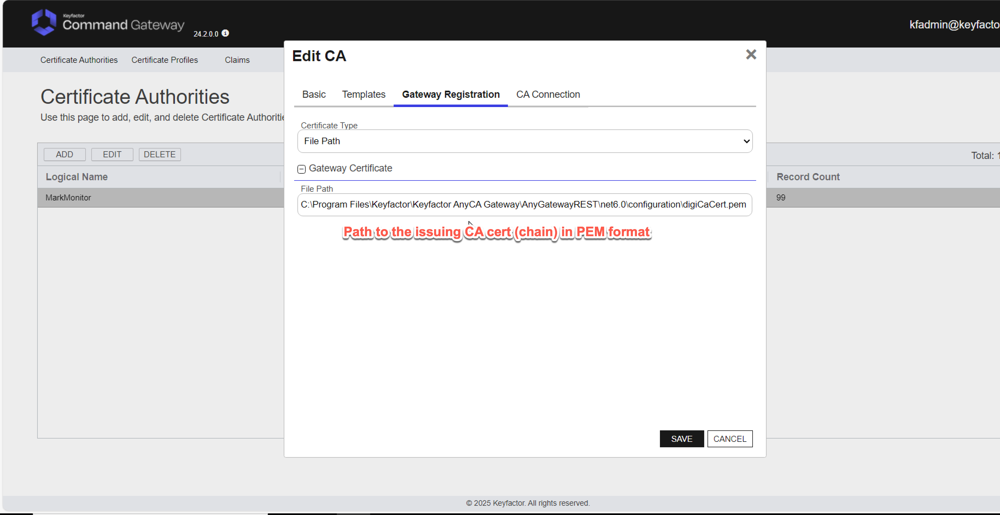
        
        ### Using Keyfactor Command certificate store for issuing CA certificate
        > **⚠️ Warning:** The cert store must already exist in Keyfactor Command.
        
        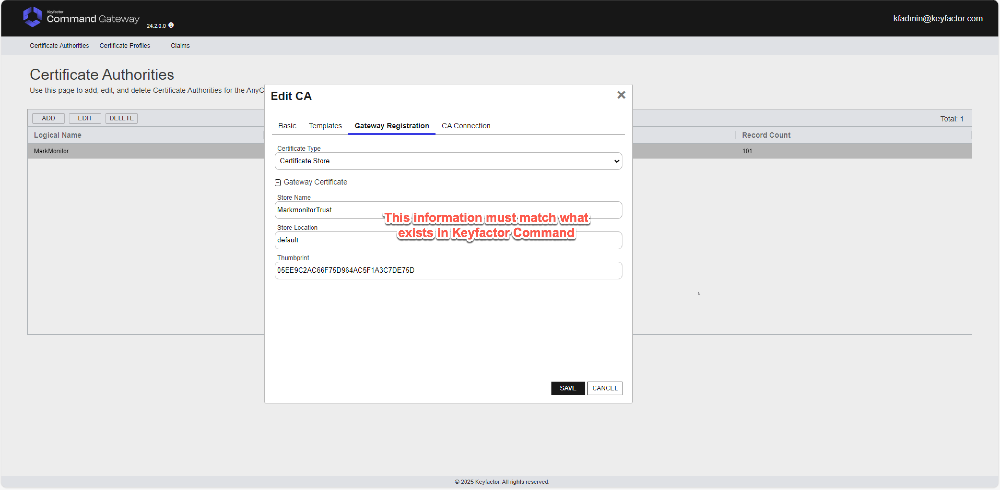

    * **CA Connection**

        Populate using the configuration fields collected in the [requirements](#requirements) section.

        * **ApiKey** - The API Key for the MarkMonitor API
        * **Username** - Username for the MarkMonitor API service account
        * **Password** - Password for the MarkMonitor API service account
        * **BaseUrl** - The Base URL for the MarkMonitor API - Usually either https://api.markmonitor.com
        * **OrgId** - The name of the MarkMonitor Organization to use for the API calls (ex: MarkMonitor). You can also use the Organization ID in GUID format.
        * **Enabled** - Flag to Enable or Disable gateway functionality. Disabling is primarily used to allow creation of the CA prior to configuration information being available.

2. A certificate template must be created in Keyfactor Command for each MarkMonitor product type you
want to enroll. One template is required per product type (see [Product IDs](#product-ids)). Below is
an example of a template for a GeoTrust DV SSL certificate. For more on certificate product types,
contact your MarkMonitor administrator or support.

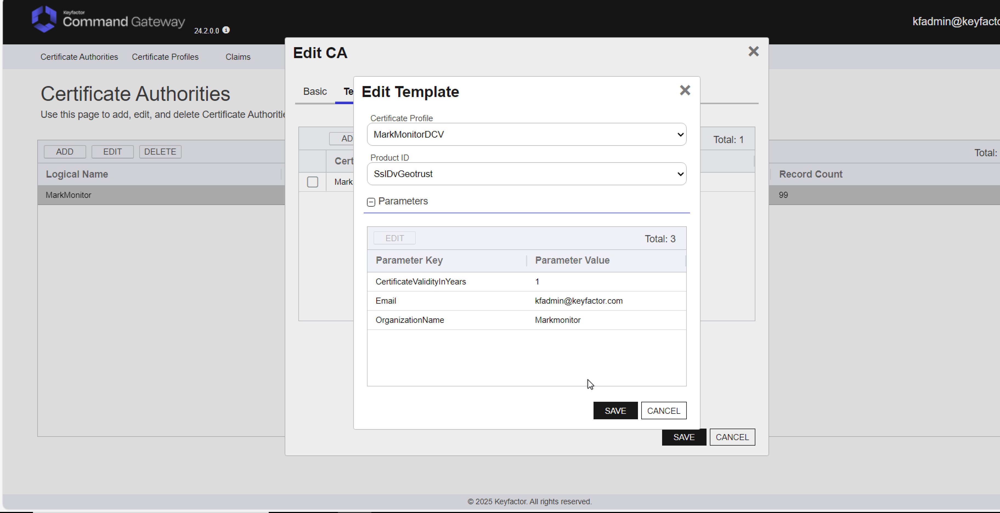

3. Follow the [official Keyfactor documentation](https://software.keyfactor.com/Guides/AnyCAGatewayREST/Content/AnyCAGatewayREST/AddCA-Keyfactor.htm) to add each defined Certificate Authority to Keyfactor Command and import the newly defined Certificate Templates.

4. In Keyfactor Command (v12.3+), for each imported Certificate Template, follow the [official documentation](https://software.keyfactor.com/Core-OnPrem/Current/Content/ReferenceGuide/Configuring%20Template%20Options.htm) to define enrollment fields for each of the following parameters:

    * **AdditionalEmails** - List of 0 or more comma separated email addresses to send the certificate to via email after generation.
    * **MarkmonitorGroup** - The name or GUID of a Markmonitor group to use for the certificate request.
    * **MarkmonitorContact** - The name or GUID of a Markmonitor contact to use for the certificate request. Will use default Markmonitor organization contact if not specified.
    * **DCVMethod** - The method to use for Domain Control Validation (DCV). Valid values are EMAIL, DNS_CNAME_TOKEN, HTTP_TOKEN, DNS_TXT_TOKEN. Default is EMAIL.
    * **comments** - Comments to attach to the MarkMonitor order. Default is "Requested via Keyfactor Command".
    * **locale** - Locale to use for the MarkMonitor order. Default is "en".
    * **provider** - The certificate provider to use for the order. Default is "DIGICERT" (currently the only provider MarkMonitor's API supports).

## MarkMonitor API Setup

MarkMonitor requires **two** credentials that are used together (there is no OAuth mode):

1. **API Key** — sent as the `X-API-KEY` header on the authentication request. Enter it in the
   `ApiKey` connector field (masked in the Command UI).
2. **Service-account username and password** — POSTed to `/auth/v1/auth/authenticate`, which returns
   a short-lived bearer token used on all subsequent calls. Enter them in the `Username` and
   `Password` connector fields (the password is masked in the UI).

Contact your MarkMonitor administrator to provision the API key and a service account with order
permissions, and to confirm the correct API base URL and organization name/ID for your environment.

## CA Connection Configuration

The following fields are presented in the AnyCA Gateway REST portal (and the Keyfactor Command
Management Portal) when creating or editing the MarkMonitor CA connector. All fields except `Enabled`
must be provided before the connector can be saved in an enabled state.

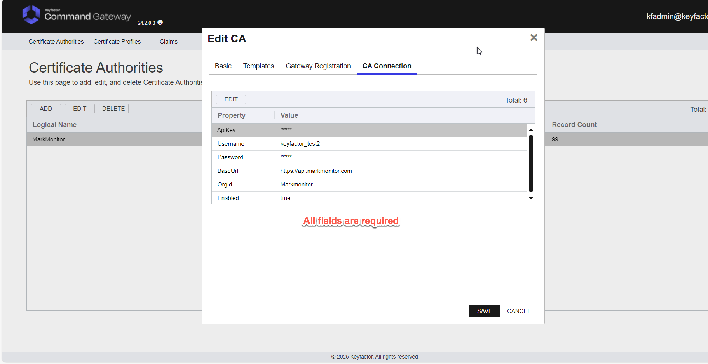

| Field | Required / Optional | Masked | Default | Description |
|---|---|---|---|---|
| `ApiKey` | Required | Yes | *(none)* | The MarkMonitor API key, sent as the `X-API-KEY` header when authenticating. |
| `Username` | Required | No | *(none)* | Username for the MarkMonitor API service account. |
| `Password` | Required | Yes | *(none)* | Password for the MarkMonitor API service account. |
| `BaseUrl` | Required | No | `https://api.markmonitor.com` | The MarkMonitor API base URL. Must start with `https://` — credentials and the bearer token are sent to it. |
| `OrgId` | Required | No | *(none)* | The MarkMonitor organization to use for API calls. Accepts either the organization **name** (e.g. `MarkMonitor`) or its **ID in GUID format**. Used to scope enrollment and to verify ownership on revoke. |
| `Enabled` | Optional | No | `true` | Enables or disables gateway functionality. Disable to allow the CA to be created before configuration information is available. |

> **Note:** Credentials are stored in Keyfactor Command's encrypted gateway configuration. `ApiKey`
> and `Password` are masked in the UI and are never written to logs by the plugin.

## Template Enrollment Parameters

Custom enrollment parameters can be added to templates in Keyfactor Command after they have been
imported from the AnyCA Gateway. **All parameters are optional** and are read case-insensitively at
enrollment time.

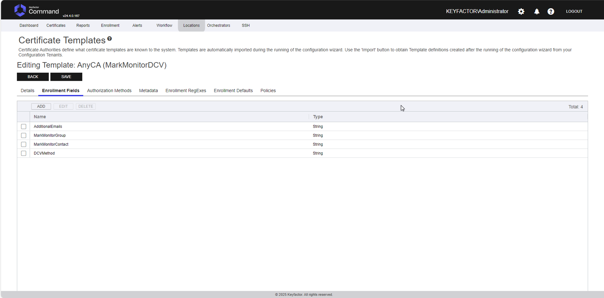

| Parameter | Type | Default | Description |
|---|---|---|---|
| `AdditionalEmails` | String | *(empty)* | Zero or more comma-separated email addresses that MarkMonitor will send the issued certificate to. Spaces are also treated as separators. |
| `MarkmonitorGroup` | String | *(none)* | The name or GUID of a MarkMonitor group to associate with the order. Matched by GUID or exact (case-insensitive) name against the account-wide group list. A blank or unresolved value is omitted (best-effort). |
| `MarkmonitorContact` | String | *(org default)* | The GUID, email, or `First Last` name of a MarkMonitor contact within the organization. Falls back to the organization's default contact if not specified or not resolvable. |
| `DCVMethod` | String | `EMAIL` | Domain Control Validation method. Valid values: `EMAIL`, `DNS_CNAME_TOKEN`, `HTTP_TOKEN`, `DNS_TXT_TOKEN`. An invalid value logs a warning and falls back to `EMAIL`. |
| `comments` | String | `Requested via Keyfactor Command` | Free-text comments attached to the MarkMonitor order. |
| `locale` | String | `en` | Locale for the MarkMonitor order. |
| `provider` | String | `DIGICERT` | The certificate provider for the order. `DIGICERT` is currently the only provider the MarkMonitor API supports. |

> **Note on DCV:** The plugin passes the selected `DCVMethod` to MarkMonitor but does not itself
> automate DNS/HTTP token publication. For `EMAIL` (the default), MarkMonitor falls back to the
> domain/organization's registered DCV contacts; the plugin sends an empty `dcvEmails` list.

## Product IDs

`GetProductIds()` returns the names of the `CertOrderTypes` enum. The **Product ID** column is the
value Keyfactor Command sees and stores; the plugin maps it to the **MarkMonitor cert type** string
(the enum's `[Description]`) when placing an order. Adding a new MarkMonitor product means adding an
enum member with the matching `[Description]` — not editing a separate list.

| Product ID (Command) | MarkMonitor cert type | Typical product family |
|---|---|---|
| `SslOvBasic` | `SSL_OV_BASIC` | OV SSL (basic) |
| `SslEvBasic` | `SSL_EV_BASIC` | EV SSL (basic) |
| `SslDvGeotrust` | `SSL_DV_GEOTRUST` | GeoTrust DV SSL |
| `SslDvThawte` | `SSL_DV_THAWTE` | Thawte DV SSL |
| `SslOvThawteWebserver` | `SSL_OV_THAWTE_WEBSERVER` | Thawte OV Web Server SSL |
| `SslEvThawteWebserver` | `SSL_EV_THAWTE_WEBSERVER` | Thawte EV Web Server SSL |
| `SslOvGeotrustTruebizid` | `SSL_OV_GEOTRUST_TRUEBIZID` | GeoTrust OV True BusinessID SSL |
| `SslEvGeotrustTruebizid` | `SSL_EV_GEOTRUST_TRUEBIZID` | GeoTrust EV True BusinessID SSL |
| `SslOvSecuresite` | `SSL_OV_SECURESITE` | DigiCert OV Secure Site SSL |
| `SslEvSecuresite` | `SSL_EV_SECURESITE` | DigiCert EV Secure Site SSL |
| `SslOvSecuresitePro` | `SSL_OV_SECURESITE_PRO` | DigiCert OV Secure Site Pro SSL |
| `SslEvSecuresitePro` | `SSL_EV_SECURESITE_PRO` | DigiCert EV Secure Site Pro SSL |

> **Note:** The "typical product family" column is descriptive. Which product types your MarkMonitor
> account may actually order — and any per-product required fields — depend on your account's
> entitlements. Confirm availability with your MarkMonitor administrator.

## Architecture

This document describes how the MarkMonitor AnyCA Gateway REST plugin integrates with Keyfactor
Command and the MarkMonitor SSL certificate API. It covers the primary certificate lifecycle
operations — synchronization, enrollment, and revocation — and how the plugin routes each through
the MarkMonitor REST API.

## Component Overview

```
┌─────────────────────────────────────────────────────────┐
│                  Keyfactor Command                       │
│                                                          │
│   Certificate Enrollment  ·  Revocation  ·  Sync Jobs    │
└────────────────────────────┬─────────────────────────────┘
                             │
                    AnyCA Gateway REST
                    (plugin host process)
                             │
┌────────────────────────────▼─────────────────────────────┐
│            MarkMonitorCAPlugin : IAnyCAPlugin             │
│                                                          │
│   Translates Keyfactor operations into MarkMonitor API   │
│   calls and maps responses back to Command's data model. │
│   MarkMonitorClient owns HTTP, bearer-token auth,        │
│   pagination, CSR handling, and status mapping.          │
└────────────────────────────┬─────────────────────────────┘
                             │  HTTPS · Bearer token + X-API-KEY
                             │
┌────────────────────────────▼─────────────────────────────┐
│               MarkMonitor REST API (DigiCert)            │
│                                                          │
│   /auth/v1/auth/authenticate   /certs/v1/order           │
│   /certs/v1/organization       /auth/v1/group            │
└──────────────────────────────────────────────────────────┘
```

The two source files that matter most:

* **`MarkMonitorCAConnector.cs`** — the `IAnyCAPlugin` entry point the Gateway host calls
  (`Initialize`, `Enroll`, `Revoke`, `Synchronize`, `GetSingleRecord`, `Ping`,
  `ValidateCAConnectionInfo`, `ValidateProductInfo`, `GetProductIds`, and the annotation pair). It
  holds the deserialized connection config and a single lazily-built `MarkMonitorClient`.
* **`Client/MarkMonitorClient.cs`** — the HTTP client for the MarkMonitor REST API. It owns
  bearer-token authentication, list pagination, CSR PEM/DER handling (via BouncyCastle), the
  enrollment dedup cache, and the MarkMonitor-order-status → Keyfactor-status mapping.

## Request Authentication

MarkMonitor uses two credentials together. The API key is sent as the `X-API-KEY` header on the
authentication request; the service-account username and password are POSTed to
`/auth/v1/auth/authenticate`, which returns a bearer token and its lifetime (`expiresIn`). Every
subsequent request carries `Authorization: Bearer <token>`.

The token is cached in the `MarkMonitorClient` instance with a small safety buffer (it is treated as
expired 30 seconds early so a request that starts just before expiry doesn't race the token dying
mid-flight). Re-authentication is lazy and guarded by double-checked locking on a semaphore: callers
that find a valid token proceed without locking; only a caller that observes an
expired/missing token takes the lock, and re-checks inside it, so concurrent operations cannot race
each other into two authentication calls or send requests under a half-written token.

```
Authorization: Bearer <token>   where token ← POST /auth/v1/auth/authenticate
                                              headers: X-API-KEY: <api key>
                                              body:    { username, password }
```

## Certificate Identifiers

MarkMonitor identifies each order by a **GUID order ID**. That order ID is what the plugin stores in
Keyfactor Command as the `CARequestID`, and it is the identifier used for every post-enrollment
operation (get single record, revoke). Because order IDs are interpolated directly into request
URLs, the client validates that any incoming order ID parses as a GUID before using it — a corrupted
or manipulated `CARequestID` fails fast with a clear error rather than producing an unexpected URL
path segment.

The configured `OrgId` may be supplied either as a friendly organization **name** or as a **GUID**.
The client resolves a name to its GUID by listing organizations filtered by name; a value that
already parses as a GUID is used directly.

---

## Gateway Startup

When the AnyCA Gateway process loads the connector, `Initialize` deserializes the CA connection data
into the plugin's config object. The `MarkMonitorClient` itself is not built until the first
operation needs it — `CreateAndAuthenticateClientAsync()` builds (or adopts an injected) client once
and caches it for the lifetime of the plugin instance. Each client method authenticates or
re-authenticates itself lazily, so startup does not force an eager authentication call.

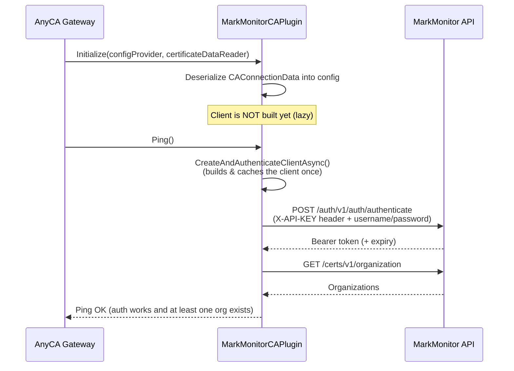

---

## Synchronization

Keyfactor Command periodically synchronizes its certificate inventory with MarkMonitor. The plugin
retrieves all orders for the account, page by page (looping until `MarkMonitorPage.TotalPages` is
reached), and feeds the issued certificates into Command's buffer.

> **Note:** The current implementation performs a **full** listing on every sync — the `lastSync`
> timestamp and `fullSync` flag passed by the framework are not yet used to filter orders by date,
> and there is no configurable page size (the connector requests a fixed page size of 100). Orders
> that have no certificate yet are skipped for the current sync rather than aborting the page.

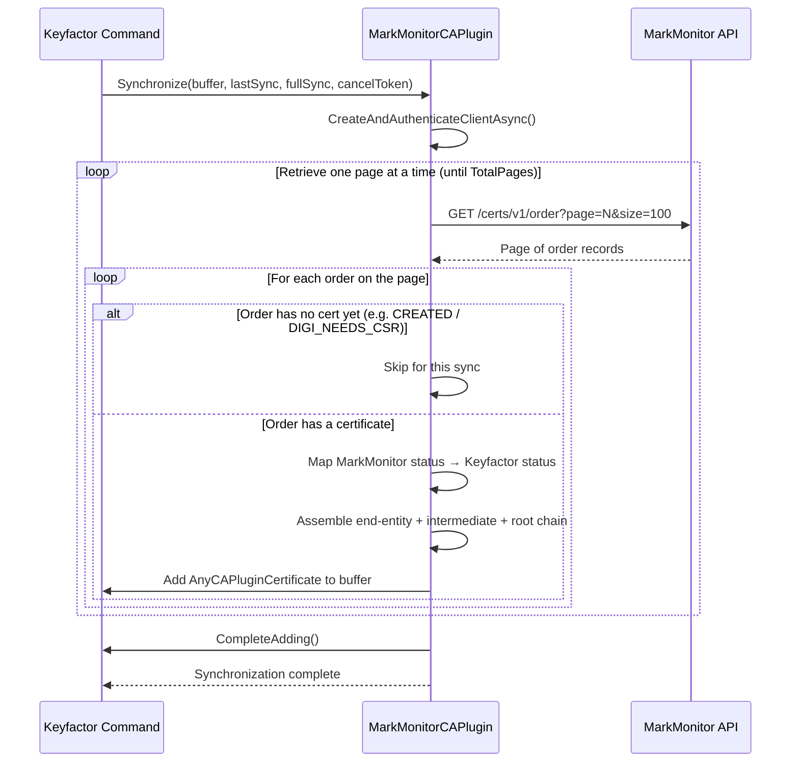

For each imported certificate the plugin builds the full chain by concatenating the end-entity,
intermediate, and root certificates returned by MarkMonitor, and records a revocation date when the
order's `RevokeStatus` is `REVOKED`. (MarkMonitor does not expose a revocation *reason* on its order
records, so a reason is not populated on the imported record.)

---

## Certificate Enrollment

When a requester submits a certificate request through Keyfactor Command, the plugin translates it
into a MarkMonitor order. It resolves the organization, contact, and (optional) group; validates and
normalizes the CSR; and places the order. Because DCV/approval is required before issuance, an
accepted order typically comes back pending.

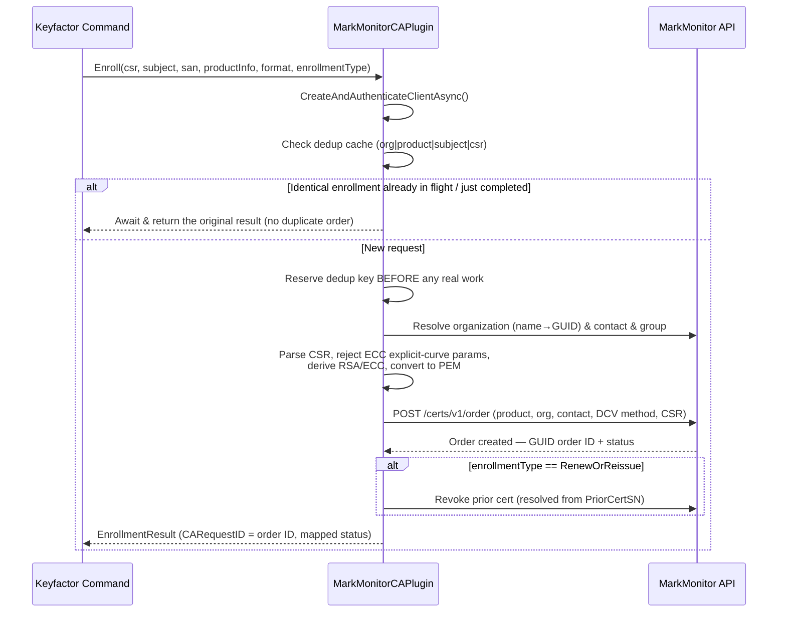

### Enrollment inputs resolved from template parameters

The plugin reads these product/template parameters (case-insensitive) when building the order —
falling back to defaults or a best-effort lookup when a value is missing or cannot be resolved:

* **Organization** — resolved from the connector `OrgId` (name or GUID). Enrollment fails if it
  cannot be resolved.
* **Contact** (`MarkmonitorContact`) — matched within the org's contacts by GUID, then email, then
  `First Last` name. Falls back to the org's `ORGANIZATION_CONTACT` (or the first contact) if the
  parameter is blank or unresolved (logged as a warning).
* **Group** (`MarkmonitorGroup`) — MarkMonitor groups are account-/tenant-wide, so this is matched by
  GUID or exact (case-insensitive) name against `/auth/v1/group`. A blank or unresolved group is
  simply omitted (best-effort; never fails the enrollment).
* **DCV method** (`DCVMethod`) — validated against `EMAIL`, `DNS_CNAME_TOKEN`, `HTTP_TOKEN`,
  `DNS_TXT_TOKEN`; an invalid value logs a warning and falls back to `EMAIL`.
* **Additional emails** (`AdditionalEmails`), **comments** (`comments`), **locale** (`locale`),
  **provider** (`provider`) — see [configuration.md](configuration.md#template-enrollment-parameters).

### Renewal / Reissue

MarkMonitor exposes reissue and cancel endpoints (`PATCH /certs/v1/order/{id}/reissue`,
`PATCH /certs/v1/order/{id}/cancel`), but the enrollment path does **not** use them. A
`RenewOrReissue` enrollment always places a brand-new order and then revokes the prior certificate.
The prior certificate's serial number is supplied by the framework in
`productInfo.ProductParameters["PriorCertSN"]`; the plugin resolves it to a `CARequestID` via the
injected `ICertificateDataReader` and revokes it after the replacement has issued successfully. If
`PriorCertSN` is missing or cannot be resolved, the enrollment is treated as a plain new issuance and
no revoke is attempted — a failure to revoke the old certificate never fails delivery of the new one.

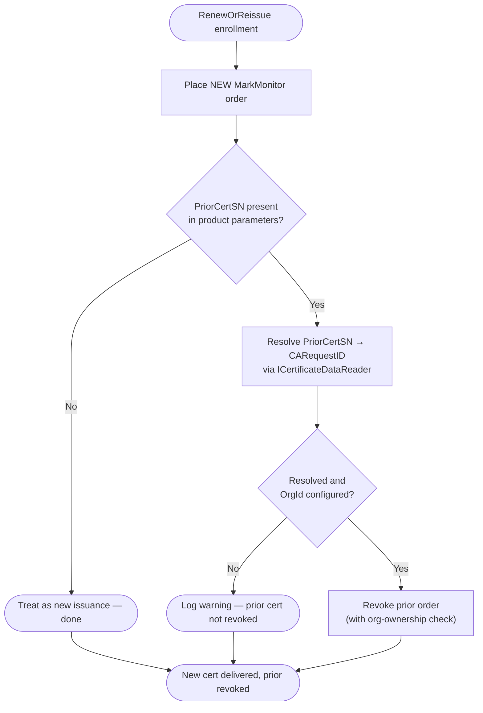

---

## Revocation

When a certificate is revoked in Keyfactor Command, the plugin first ensures an `OrgId` is
configured, then verifies the target order belongs to that organization before calling MarkMonitor's
revoke endpoint.

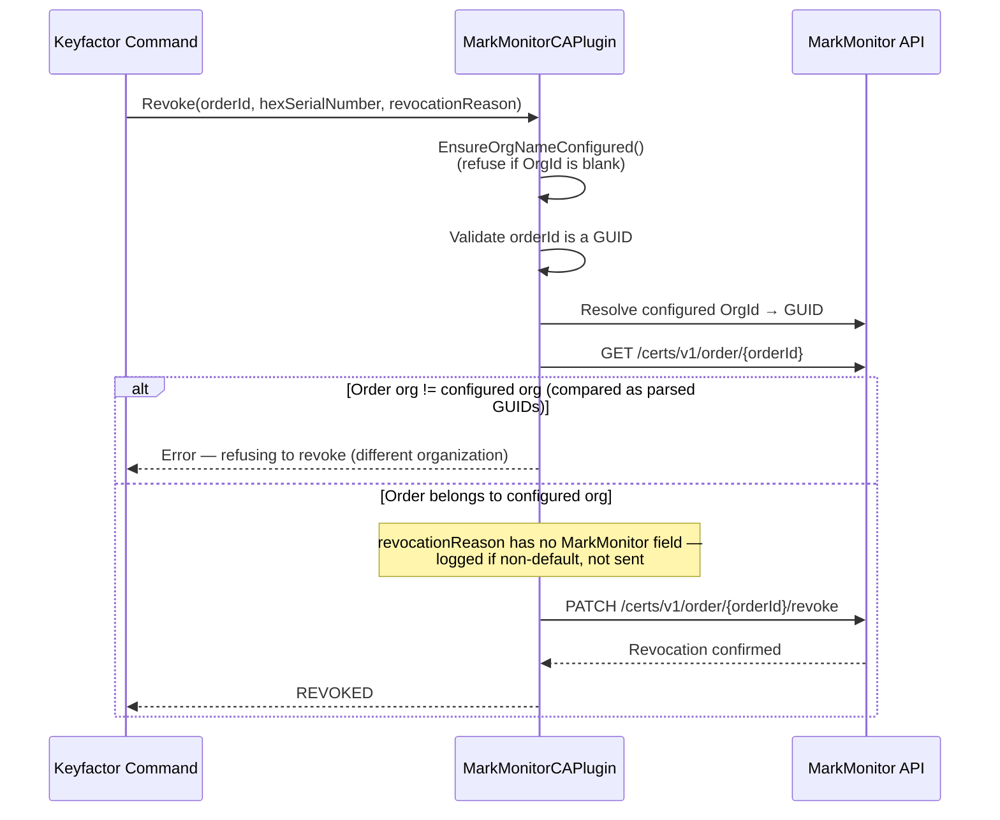

**Ownership check:** the configured org and the order's org are compared as **parsed GUIDs**, not raw
strings, so an admin-configured `OrgId` in a non-canonical format (braces, no dashes, etc.) still
matches MarkMonitor's canonical serialization of the same GUID.

**Reason codes:** MarkMonitor's revoke schema has no reason field, so the Keyfactor reason code
cannot be forwarded. A non-default reason is logged rather than silently dropped.

---

## Connector Validation

When an administrator saves or edits the CA connector, `ValidateCAConnectionInfo` checks the supplied
fields before the connector can be saved in an enabled state.

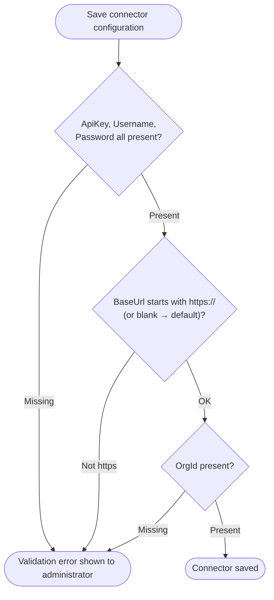

`ValidateCAConnectionInfo` performs field-level validation only (it does not place a live API call);
`Ping` is the live connectivity check — it authenticates and lists organizations. `ValidateProductInfo`
is intentionally a no-op: contact/group values are resolved (and gracefully defaulted) at enroll
time rather than validated at template-save time, to avoid coupling template configuration to
MarkMonitor's availability.

---

## Order Status Mapping

`MarkMonitorClient.MarkMonitorCertificateStatusToCAStatus` maps MarkMonitor `OrderStatus` values to
Keyfactor `EndEntityStatus`:

| MarkMonitor order status | Keyfactor status |
|---|---|
| `DIGI_PENDING`, `DIGI_PROCESSING`, `DIGI_REISSUE_PENDING`, `DIGI_WAITING_PICKUP`, `REISSUE_PENDING`, `DIGI_NEEDS_APPROVAL`, `REISSUE_REQUEST_PENDING` | `INPROCESS` |
| `CREATED` | `EXTERNALVALIDATION` (accepted, awaiting DCV/issuance) |
| `DIGI_ISSUED` | `GENERATED` (issued) |
| `DIGI_REVOKED` | `REVOKED` |
| `DIGI_FAILED`, `DIGI_REISSUE_FAILED` | `FAILED` |
| `DIGI_CANCELED`, `DIGI_REJECTED`, `DIGI_EXPIRED`, `DIGI_NEEDS_CSR` | `CANCELLED` |
| *(null/empty or unrecognized status)* | `FAILED` |

> `CREATED` is deliberately mapped to `EXTERNALVALIDATION`, not `INITIALIZED`. The AnyCA Gateway REST
> framework treats `INITIALIZED` as a hard enrollment failure, which caused freshly-created orders
> (that were in fact accepted by MarkMonitor and simply awaiting DCV/issuance) to be reported as
> failures. `EXTERNALVALIDATION` is what the framework treats as "accepted, still pending".

## API Endpoint Reference

| Operation | MarkMonitor API endpoint |
|---|---|
| Authenticate / obtain bearer token | `POST /auth/v1/auth/authenticate` (with `X-API-KEY` header) |
| List certificate orders (sync) | `GET /certs/v1/order` (paginated via `page`/`size`) |
| Get a single order | `GET /certs/v1/order/{orderId}` |
| Place a new order (enroll) | `POST /certs/v1/order` |
| Revoke a certificate | `PATCH /certs/v1/order/{orderId}/revoke` |
| Cancel an order | `PATCH /certs/v1/order/{orderId}/cancel` |
| Reissue a certificate | `PATCH /certs/v1/order/{orderId}/reissue` |
| List organizations | `GET /certs/v1/organization` (paginated) |
| Get an organization | `GET /certs/v1/organization/{orgId}` |
| List groups | `GET /auth/v1/group` (paginated) |

> The cancel and reissue endpoints exist in the client but are not currently invoked by the
> `IAnyCAPlugin` operations (enrollment reissue is implemented as new-order-plus-revoke; see
> [Renewal / Reissue](#renewal--reissue)).

## License

Apache License 2.0, see [LICENSE](LICENSE).

## Related Integrations

See all [Keyfactor Any CA Gateways (REST)](https://github.com/orgs/Keyfactor/repositories?q=anycagateway).
