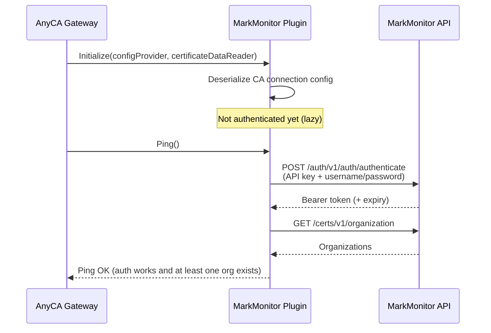
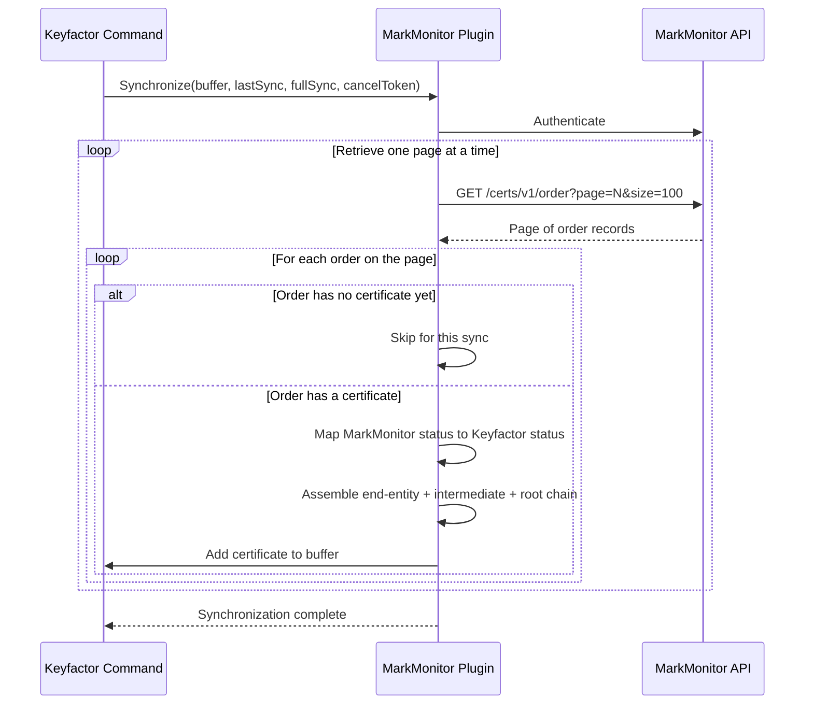
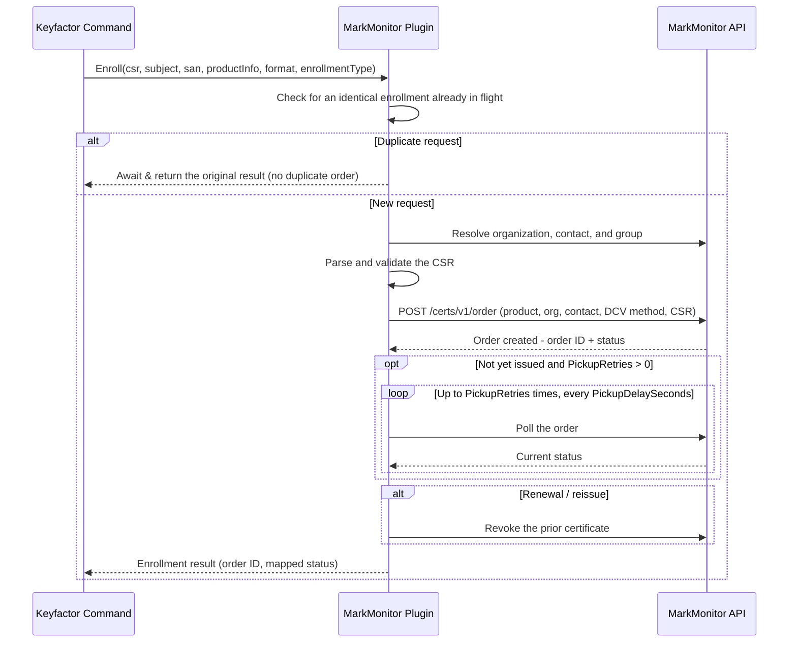
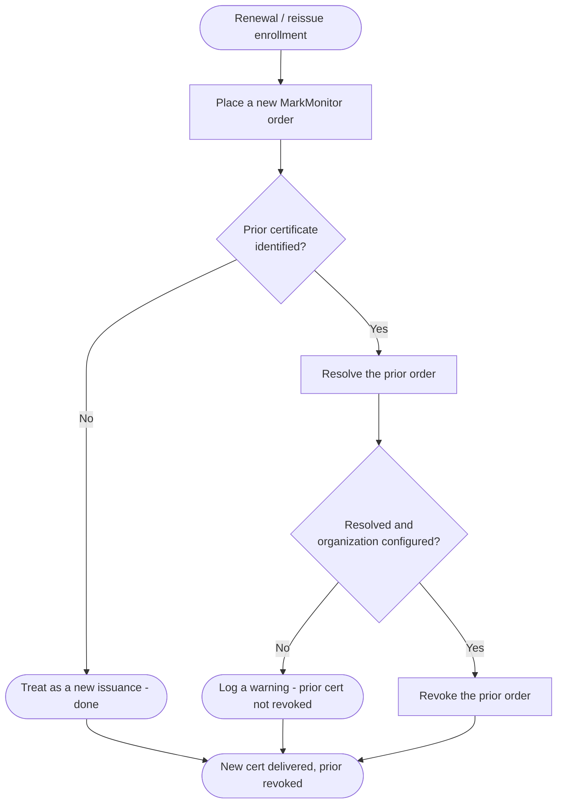
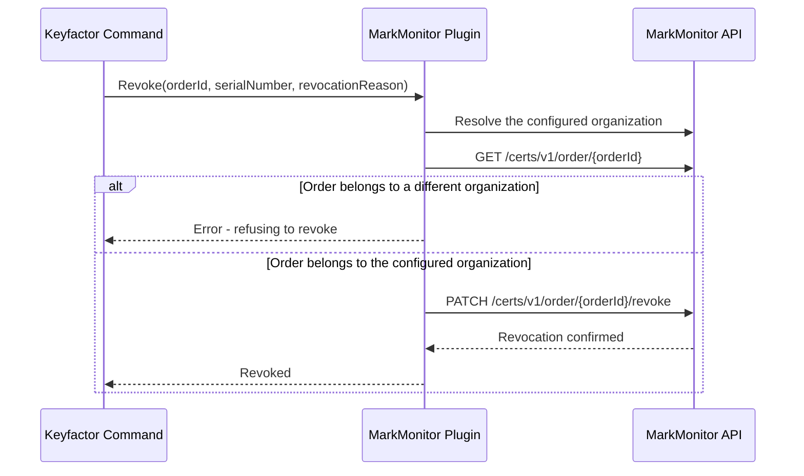
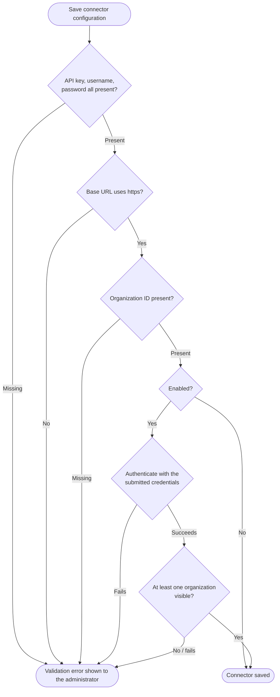

# Architecture reference
{: .no_toc }

Sequence and flow diagrams for the plugin's core certificate lifecycle operations - useful if you
want to understand exactly what happens, in what order, when Keyfactor Command asks this plugin to
start up, sync, enroll, renew, revoke, or validate a connection.

1. TOC
{: toc}

---

## Gateway startup

When the AnyCA Gateway loads the plugin, it deserializes the CA connection configuration first.
Authentication is lazy - it doesn't happen until the Gateway calls `Ping()` to verify connectivity.

## Synchronization

Keyfactor Command periodically syncs its certificate inventory with MarkMonitor. The plugin walks
every order, page by page, and feeds issued certificates into Command's buffer.

## Certificate enrollment

When someone requests a certificate through Keyfactor Command, the plugin resolves the
organization/contact/group, validates the CSR, and places a MarkMonitor order. Because domain
control validation is required before issuance, an accepted order typically comes back pending.

A product whose DCV/approval resolves quickly can come back issued from this same enrollment call
instead of always waiting for the next sync. Set `PickupRetries` to `0` to disable polling and
restore the always-returns-pending behavior.

### Renewal / reissue

A renewal or reissue always places a brand-new order first, then revokes the certificate it's
replacing - it never touches MarkMonitor's own reissue endpoint. If the prior certificate can't be
identified, the new certificate is still issued; only the revoke step is skipped.

## Revocation

Before revoking a certificate, the plugin verifies the order actually belongs to the organization
configured on the connector - it refuses to revoke an order from a different organization.

## Connector validation

When an administrator saves or edits the CA connector, the plugin checks the supplied fields before
allowing it to be saved in an enabled state. If the connector is being saved *enabled*, it also makes
a live call to MarkMonitor to confirm the credentials actually work — using a client built from
exactly what's about to be saved, not the connector's already-cached client. Saving with `Enabled`
set to `false` skips that live check, so a connector can be created before real credentials are
available.

---

## Order status mapping

MarkMonitor order statuses are mapped to Keyfactor statuses as follows:

| MarkMonitor order status | Keyfactor status |
|---|---|
| `DIGI_PENDING`, `DIGI_PROCESSING`, `DIGI_REISSUE_PENDING`, `DIGI_WAITING_PICKUP`, `REISSUE_PENDING`, `DIGI_NEEDS_APPROVAL`, `REISSUE_REQUEST_PENDING` | `INPROCESS` |
| `CREATED` | `EXTERNALVALIDATION` (accepted, awaiting DCV/issuance) |
| `DIGI_ISSUED` | `GENERATED` (issued) |
| `DIGI_REVOKED` | `REVOKED` |
| `DIGI_FAILED`, `DIGI_REISSUE_FAILED` | `FAILED` |
| `DIGI_CANCELED`, `DIGI_REJECTED`, `DIGI_EXPIRED`, `DIGI_NEEDS_CSR` | `CANCELLED` |
| *(null/empty or unrecognized status)* | `FAILED` |

A freshly-submitted order (`CREATED`) is deliberately mapped to `EXTERNALVALIDATION` rather than a
failure status — the order was accepted by MarkMonitor and is simply awaiting DCV or issuance. Once
the order reaches `DIGI_ISSUED`, the next synchronization imports the certificate.

## API endpoint reference

| Operation | MarkMonitor API endpoint |
|---|---|
| Authenticate / obtain bearer token | `POST /auth/v1/auth/authenticate` (with `X-API-KEY` header) |
| List certificate orders (sync) | `GET /certs/v1/order` (paginated via `page`/`size`) |
| Get a single order | `GET /certs/v1/order/{orderId}` |
| Place a new order (enroll) | `POST /certs/v1/order` |
| Revoke a certificate | `PATCH /certs/v1/order/{orderId}/revoke` |
| Cancel an order | `PATCH /certs/v1/order/{orderId}/cancel` |
| Reissue a certificate | `PATCH /certs/v1/order/{orderId}/reissue` |
| List organizations | `GET /certs/v1/organization` (paginated) |
| Get an organization | `GET /certs/v1/organization/{orgId}` |
| List groups | `GET /auth/v1/group` (paginated) |

The cancel and reissue endpoints exist in the client but aren't currently used — a renewal/reissue
places a new order and then revokes the prior certificate, rather than calling MarkMonitor's own
reissue action.

---

Looking for implementation-level detail behind these diagrams — real class and method names, retry
and locking behavior, template-parameter resolution rules? See
[`DEVELOPMENT.md`](https://github.com/Keyfactor/markmonitor-caplugin/blob/main/DEVELOPMENT.md) in
the repository.
