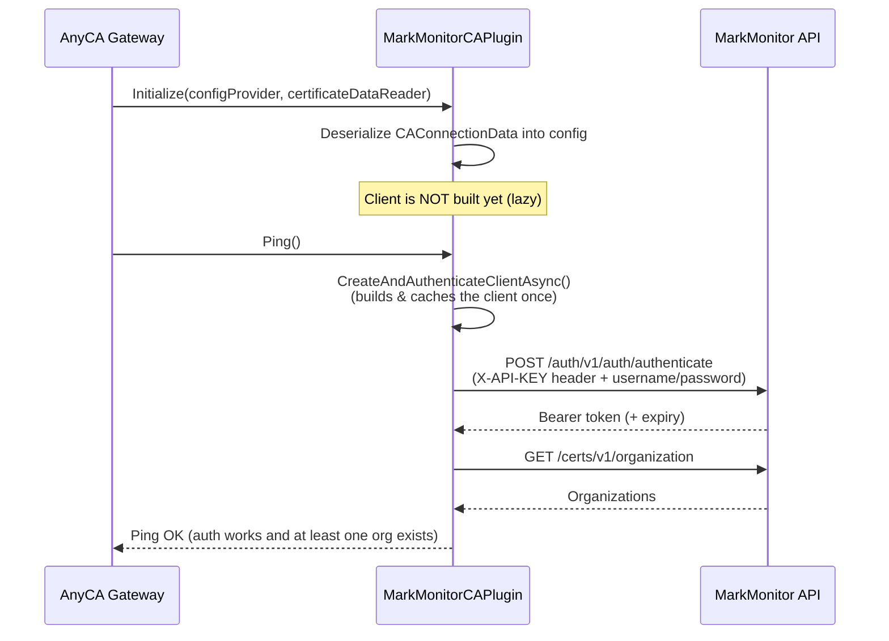
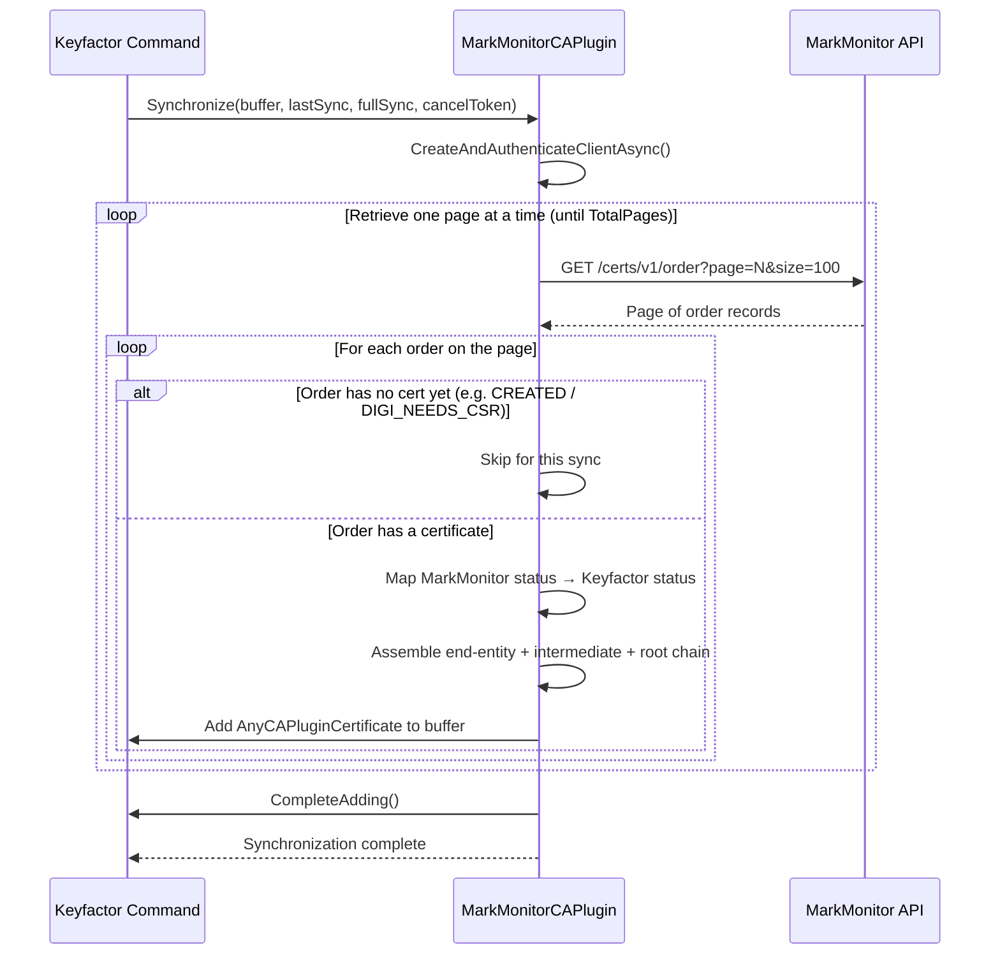
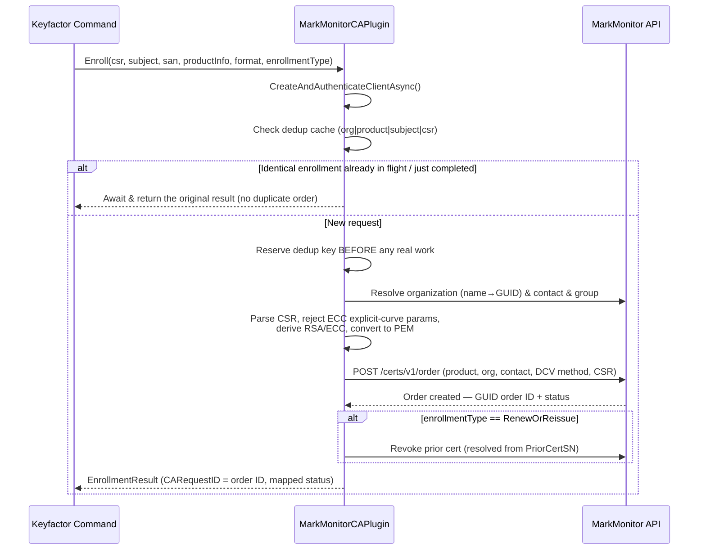
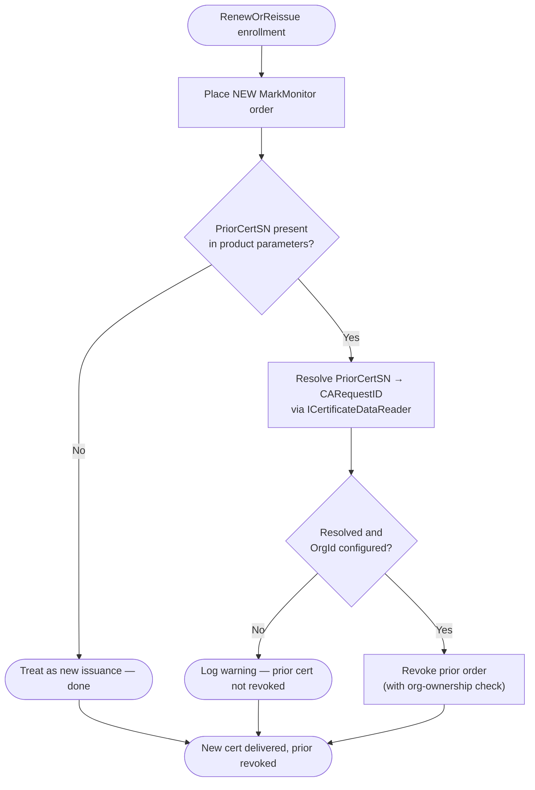
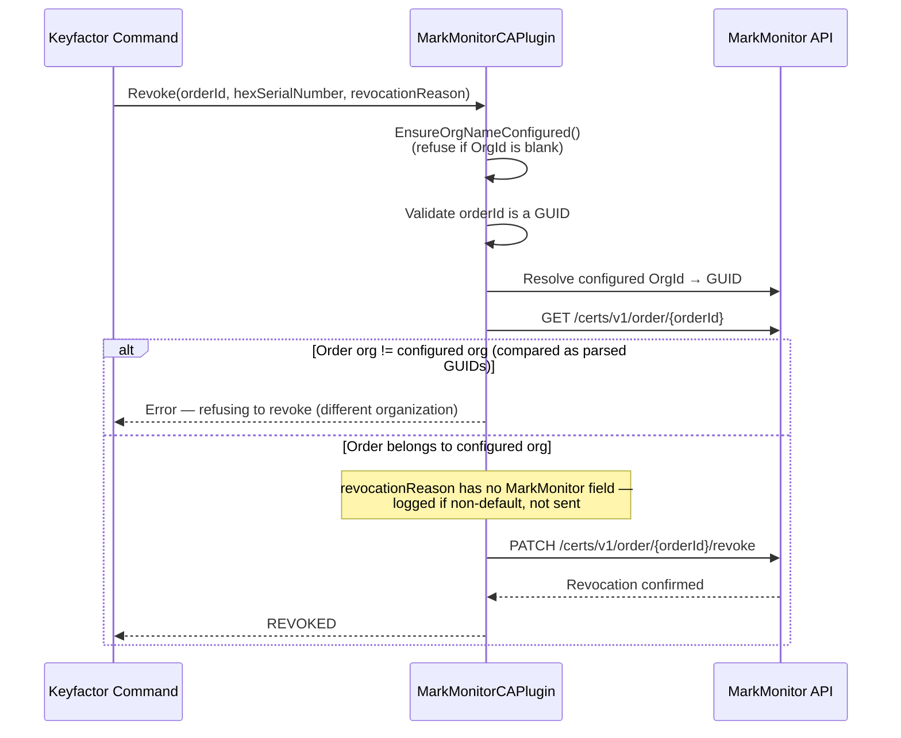
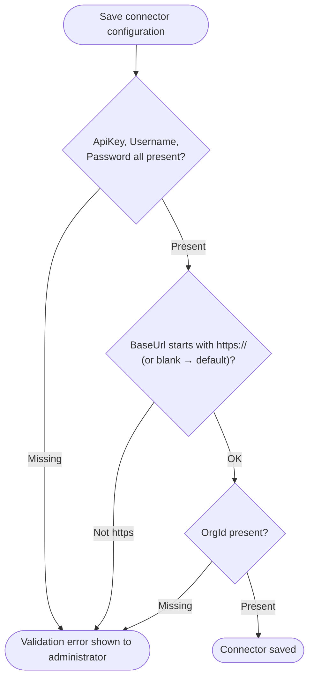

## Architecture

This document describes how the MarkMonitor AnyCA Gateway REST plugin integrates with Keyfactor
Command and the MarkMonitor SSL certificate API. It covers the primary certificate lifecycle
operations — synchronization, enrollment, and revocation — and how the plugin routes each through
the MarkMonitor REST API.

## Component Overview

```
┌─────────────────────────────────────────────────────────┐
│                  Keyfactor Command                       │
│                                                          │
│   Certificate Enrollment  ·  Revocation  ·  Sync Jobs    │
└────────────────────────────┬─────────────────────────────┘
                             │
                    AnyCA Gateway REST
                    (plugin host process)
                             │
┌────────────────────────────▼─────────────────────────────┐
│            MarkMonitorCAPlugin : IAnyCAPlugin             │
│                                                          │
│   Translates Keyfactor operations into MarkMonitor API   │
│   calls and maps responses back to Command's data model. │
│   MarkMonitorClient owns HTTP, bearer-token auth,        │
│   pagination, CSR handling, and status mapping.          │
└────────────────────────────┬─────────────────────────────┘
                             │  HTTPS · Bearer token + X-API-KEY
                             │
┌────────────────────────────▼─────────────────────────────┐
│               MarkMonitor REST API (DigiCert)            │
│                                                          │
│   /auth/v1/auth/authenticate   /certs/v1/order           │
│   /certs/v1/organization       /auth/v1/group            │
└──────────────────────────────────────────────────────────┘
```

The two source files that matter most:

* **`MarkMonitorCAConnector.cs`** — the `IAnyCAPlugin` entry point the Gateway host calls
  (`Initialize`, `Enroll`, `Revoke`, `Synchronize`, `GetSingleRecord`, `Ping`,
  `ValidateCAConnectionInfo`, `ValidateProductInfo`, `GetProductIds`, and the annotation pair). It
  holds the deserialized connection config and a single lazily-built `MarkMonitorClient`.
* **`Client/MarkMonitorClient.cs`** — the HTTP client for the MarkMonitor REST API. It owns
  bearer-token authentication, list pagination, CSR PEM/DER handling (via BouncyCastle), the
  enrollment dedup cache, and the MarkMonitor-order-status → Keyfactor-status mapping.

## Request Authentication

MarkMonitor uses two credentials together. The API key is sent as the `X-API-KEY` header on the
authentication request; the service-account username and password are POSTed to
`/auth/v1/auth/authenticate`, which returns a bearer token and its lifetime (`expiresIn`). Every
subsequent request carries `Authorization: Bearer <token>`.

The token is cached in the `MarkMonitorClient` instance with a small safety buffer (it is treated as
expired 30 seconds early so a request that starts just before expiry doesn't race the token dying
mid-flight). Re-authentication is lazy and guarded by double-checked locking on a semaphore: callers
that find a valid token proceed without locking; only a caller that observes an
expired/missing token takes the lock, and re-checks inside it, so concurrent operations cannot race
each other into two authentication calls or send requests under a half-written token.

```
Authorization: Bearer <token>   where token ← POST /auth/v1/auth/authenticate
                                              headers: X-API-KEY: <api key>
                                              body:    { username, password }
```

## Certificate Identifiers

MarkMonitor identifies each order by a **GUID order ID**. That order ID is what the plugin stores in
Keyfactor Command as the `CARequestID`, and it is the identifier used for every post-enrollment
operation (get single record, revoke). Because order IDs are interpolated directly into request
URLs, the client validates that any incoming order ID parses as a GUID before using it — a corrupted
or manipulated `CARequestID` fails fast with a clear error rather than producing an unexpected URL
path segment.

The configured `OrgId` may be supplied either as a friendly organization **name** or as a **GUID**.
The client resolves a name to its GUID by listing organizations filtered by name; a value that
already parses as a GUID is used directly.

---

## Gateway Startup

When the AnyCA Gateway process loads the connector, `Initialize` deserializes the CA connection data
into the plugin's config object. The `MarkMonitorClient` itself is not built until the first
operation needs it — `CreateAndAuthenticateClientAsync()` builds (or adopts an injected) client once
and caches it for the lifetime of the plugin instance. Each client method authenticates or
re-authenticates itself lazily, so startup does not force an eager authentication call.



---

## Synchronization

Keyfactor Command periodically synchronizes its certificate inventory with MarkMonitor. The plugin
retrieves all orders for the account, page by page (looping until `MarkMonitorPage.TotalPages` is
reached), and feeds the issued certificates into Command's buffer.

> **Note:** The current implementation performs a **full** listing on every sync — the `lastSync`
> timestamp and `fullSync` flag passed by the framework are not yet used to filter orders by date,
> and there is no configurable page size (the connector requests a fixed page size of 100). Orders
> that have no certificate yet are skipped for the current sync rather than aborting the page.



For each imported certificate the plugin builds the full chain by concatenating the end-entity,
intermediate, and root certificates returned by MarkMonitor, and records a revocation date when the
order's `RevokeStatus` is `REVOKED`. (MarkMonitor does not expose a revocation *reason* on its order
records, so a reason is not populated on the imported record.)

---

## Certificate Enrollment

When a requester submits a certificate request through Keyfactor Command, the plugin translates it
into a MarkMonitor order. It resolves the organization, contact, and (optional) group; validates and
normalizes the CSR; and places the order. Because DCV/approval is required before issuance, an
accepted order typically comes back pending.



### Enrollment inputs resolved from template parameters

The plugin reads these product/template parameters (case-insensitive) when building the order —
falling back to defaults or a best-effort lookup when a value is missing or cannot be resolved:

* **Organization** — resolved from the connector `OrgId` (name or GUID). Enrollment fails if it
  cannot be resolved.
* **Contact** (`MarkmonitorContact`) — matched within the org's contacts by GUID, then email, then
  `First Last` name. Falls back to the org's `ORGANIZATION_CONTACT` (or the first contact) if the
  parameter is blank or unresolved (logged as a warning).
* **Group** (`MarkmonitorGroup`) — MarkMonitor groups are account-/tenant-wide, so this is matched by
  GUID or exact (case-insensitive) name against `/auth/v1/group`. A blank or unresolved group is
  simply omitted (best-effort; never fails the enrollment).
* **DCV method** (`DCVMethod`) — validated against `EMAIL`, `DNS_CNAME_TOKEN`, `HTTP_TOKEN`,
  `DNS_TXT_TOKEN`; an invalid value logs a warning and falls back to `EMAIL`.
* **Additional emails** (`AdditionalEmails`), **comments** (`comments`), **locale** (`locale`),
  **provider** (`provider`) — see [configuration.md](configuration.md#template-enrollment-parameters).

### Renewal / Reissue

MarkMonitor exposes reissue and cancel endpoints (`PATCH /certs/v1/order/{id}/reissue`,
`PATCH /certs/v1/order/{id}/cancel`), but the enrollment path does **not** use them. A
`RenewOrReissue` enrollment always places a brand-new order and then revokes the prior certificate.
The prior certificate's serial number is supplied by the framework in
`productInfo.ProductParameters["PriorCertSN"]`; the plugin resolves it to a `CARequestID` via the
injected `ICertificateDataReader` and revokes it after the replacement has issued successfully. If
`PriorCertSN` is missing or cannot be resolved, the enrollment is treated as a plain new issuance and
no revoke is attempted — a failure to revoke the old certificate never fails delivery of the new one.



---

## Revocation

When a certificate is revoked in Keyfactor Command, the plugin first ensures an `OrgId` is
configured, then verifies the target order belongs to that organization before calling MarkMonitor's
revoke endpoint.



**Ownership check:** the configured org and the order's org are compared as **parsed GUIDs**, not raw
strings, so an admin-configured `OrgId` in a non-canonical format (braces, no dashes, etc.) still
matches MarkMonitor's canonical serialization of the same GUID.

**Reason codes:** MarkMonitor's revoke schema has no reason field, so the Keyfactor reason code
cannot be forwarded. A non-default reason is logged rather than silently dropped.

---

## Connector Validation

When an administrator saves or edits the CA connector, `ValidateCAConnectionInfo` checks the supplied
fields before the connector can be saved in an enabled state.



`ValidateCAConnectionInfo` performs field-level validation only (it does not place a live API call);
`Ping` is the live connectivity check — it authenticates and lists organizations. `ValidateProductInfo`
is intentionally a no-op: contact/group values are resolved (and gracefully defaulted) at enroll
time rather than validated at template-save time, to avoid coupling template configuration to
MarkMonitor's availability.

---

## Order Status Mapping

`MarkMonitorClient.MarkMonitorCertificateStatusToCAStatus` maps MarkMonitor `OrderStatus` values to
Keyfactor `EndEntityStatus`:

| MarkMonitor order status | Keyfactor status |
|---|---|
| `DIGI_PENDING`, `DIGI_PROCESSING`, `DIGI_REISSUE_PENDING`, `DIGI_WAITING_PICKUP`, `REISSUE_PENDING`, `DIGI_NEEDS_APPROVAL`, `REISSUE_REQUEST_PENDING` | `INPROCESS` |
| `CREATED` | `EXTERNALVALIDATION` (accepted, awaiting DCV/issuance) |
| `DIGI_ISSUED` | `GENERATED` (issued) |
| `DIGI_REVOKED` | `REVOKED` |
| `DIGI_FAILED`, `DIGI_REISSUE_FAILED` | `FAILED` |
| `DIGI_CANCELED`, `DIGI_REJECTED`, `DIGI_EXPIRED`, `DIGI_NEEDS_CSR` | `CANCELLED` |
| *(null/empty or unrecognized status)* | `FAILED` |

> `CREATED` is deliberately mapped to `EXTERNALVALIDATION`, not `INITIALIZED`. The AnyCA Gateway REST
> framework treats `INITIALIZED` as a hard enrollment failure, which caused freshly-created orders
> (that were in fact accepted by MarkMonitor and simply awaiting DCV/issuance) to be reported as
> failures. `EXTERNALVALIDATION` is what the framework treats as "accepted, still pending".

## API Endpoint Reference

| Operation | MarkMonitor API endpoint |
|---|---|
| Authenticate / obtain bearer token | `POST /auth/v1/auth/authenticate` (with `X-API-KEY` header) |
| List certificate orders (sync) | `GET /certs/v1/order` (paginated via `page`/`size`) |
| Get a single order | `GET /certs/v1/order/{orderId}` |
| Place a new order (enroll) | `POST /certs/v1/order` |
| Revoke a certificate | `PATCH /certs/v1/order/{orderId}/revoke` |
| Cancel an order | `PATCH /certs/v1/order/{orderId}/cancel` |
| Reissue a certificate | `PATCH /certs/v1/order/{orderId}/reissue` |
| List organizations | `GET /certs/v1/organization` (paginated) |
| Get an organization | `GET /certs/v1/organization/{orgId}` |
| List groups | `GET /auth/v1/group` (paginated) |

> The cancel and reissue endpoints exist in the client but are not currently invoked by the
> `IAnyCAPlugin` operations (enrollment reissue is implemented as new-order-plus-revoke; see
> [Renewal / Reissue](#renewal--reissue)).
