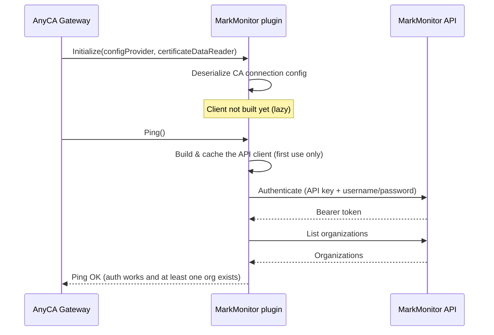
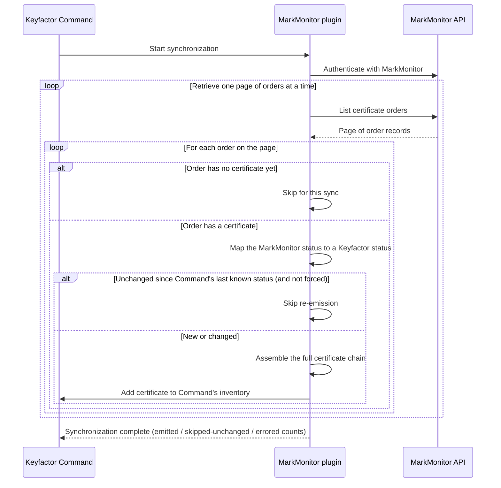
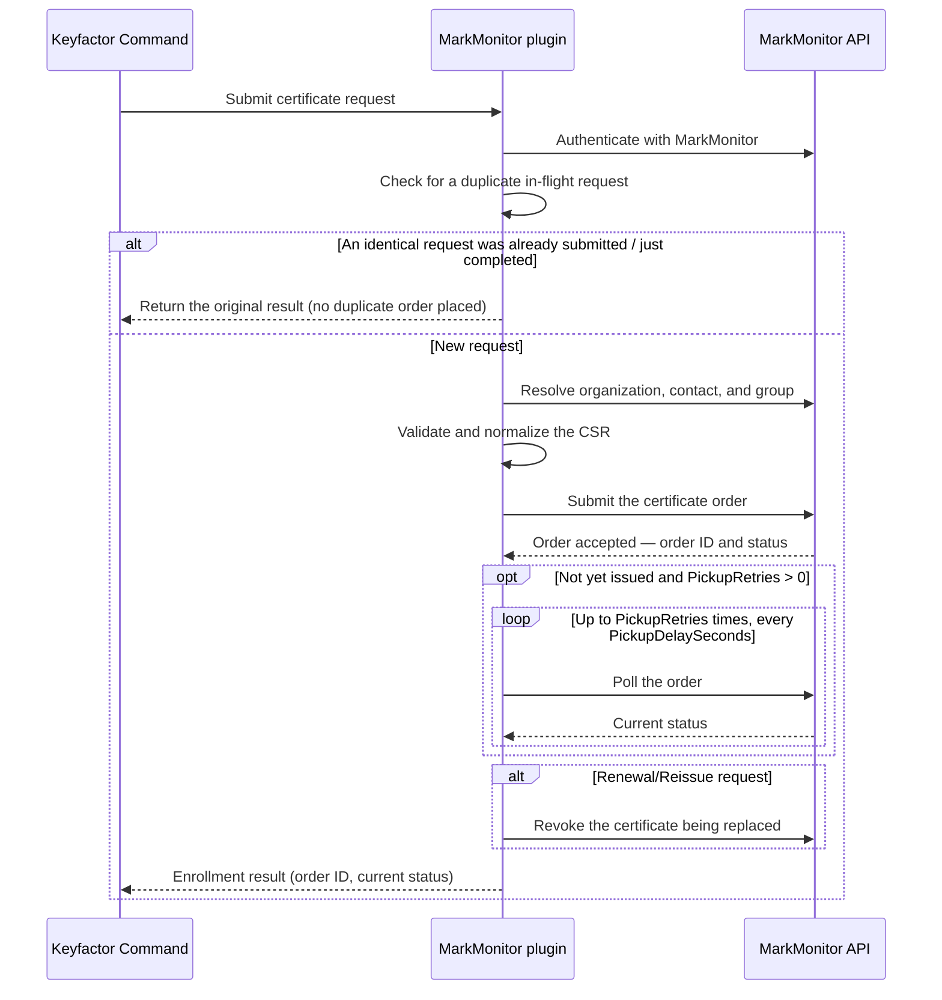
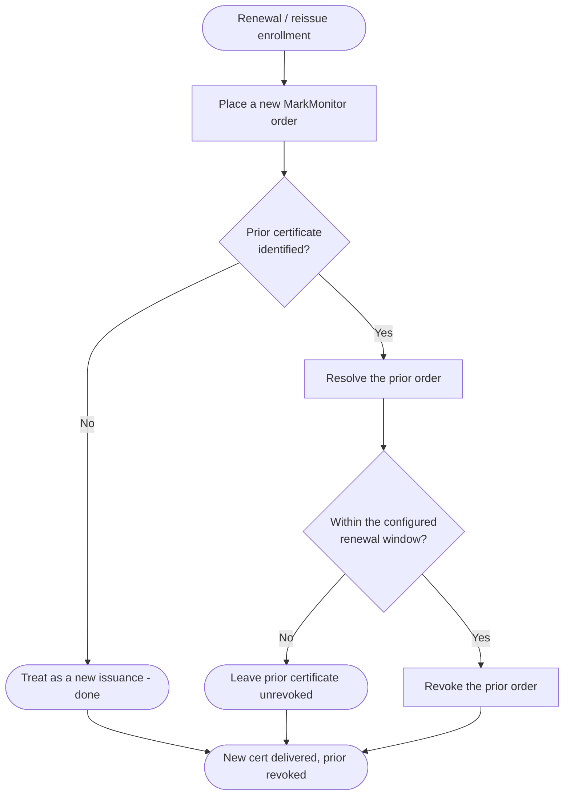
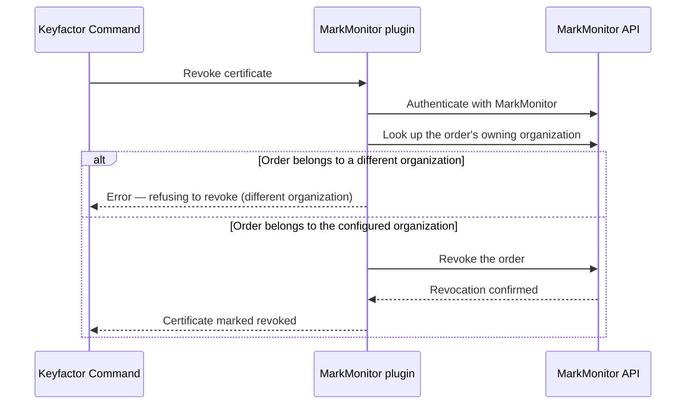
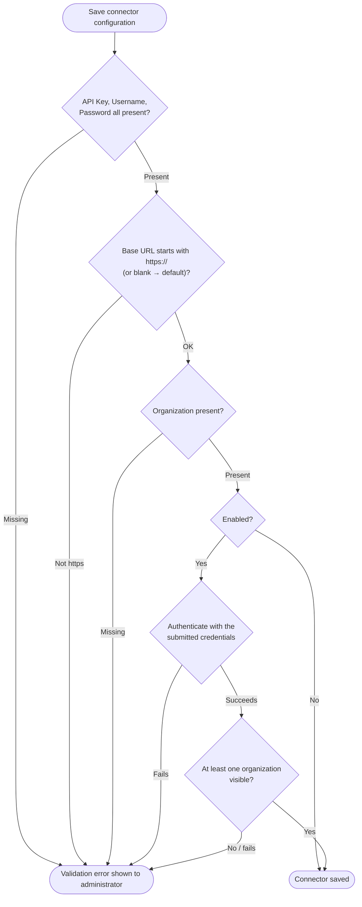

## Architecture

This document describes how the MarkMonitor AnyCA Gateway REST plugin integrates with Keyfactor Command and the MarkMonitor SSL certificate API. It covers the primary certificate lifecycle operations — synchronization, enrollment, and revocation — and how the plugin routes each through the MarkMonitor REST API.

## Component Overview

```
┌─────────────────────────────────────────────────────────┐
│                  Keyfactor Command                       │
│                                                          │
│   Certificate Enrollment  ·  Revocation  ·  Sync Jobs    │
└────────────────────────────┬─────────────────────────────┘
                             │
                    AnyCA Gateway REST
                    (plugin host process)
                             │
┌────────────────────────────▼─────────────────────────────┐
│                   The MarkMonitor plugin                  │
│                                                          │
│   Translates Keyfactor operations into MarkMonitor API   │
│   calls and maps responses back to Command's data model. │
└────────────────────────────┬─────────────────────────────┘
                             │  HTTPS · Bearer token + X-API-KEY
                             │
┌────────────────────────────▼─────────────────────────────┐
│               MarkMonitor REST API (DigiCert)            │
│                                                          │
│   /auth/v1/auth/authenticate   /certs/v1/order           │
│   /certs/v1/organization       /auth/v1/group            │
└──────────────────────────────────────────────────────────┘
```

## Request Authentication

MarkMonitor uses two credentials together. The API key is sent as the `X-API-KEY` header on the authentication request; the service-account username and password are POSTed to `/auth/v1/auth/authenticate`, which returns a bearer token and its lifetime. Every subsequent request carries that token in an `Authorization: Bearer` header.

```
Authorization: Bearer <token>   where token ← POST /auth/v1/auth/authenticate
                                              headers: X-API-KEY: <api key>
                                              body:    { username, password }
```

The token is cached for the lifetime of the plugin's API client and refreshed automatically shortly before it expires — a normal enrollment, sync, or revoke call never has to authenticate explicitly. There is no OAuth client-credentials mode.

## Certificate Identifiers

MarkMonitor identifies each order by a **GUID order ID**. That order ID is what the plugin stores in Keyfactor Command as the request identifier, and it is the identifier used for every post-enrollment operation (status check, revoke). Any order ID arriving from Command is validated as a GUID before use.

The configured organization (`OrgId`) may be supplied either as a friendly **name** or as a **GUID** — the plugin resolves a name to its GUID by listing organizations and matching exactly (case-insensitive); a value that already parses as a GUID is used directly.

---

## Gateway Startup

When the AnyCA Gateway loads the plugin, it deserializes the CA connection configuration first. The API client itself isn't built until the first operation needs it, and authentication is lazy on top of that — it doesn't happen until the Gateway calls `Ping()` to verify connectivity.



---

## Synchronization

Keyfactor Command periodically synchronizes its certificate inventory with MarkMonitor. The plugin retrieves all certificate orders visible to the configured organization, page by page, and imports issued certificates — along with their full certificate chain — into Command.



> A record that fails to process is logged, counted, and skipped rather than aborting the sync - but
> the sync aborts outright if more than 25% of records fail once at least 50 have been observed.

> The current implementation always performs a full listing of orders on each sync, rather than only
> retrieving certificates that changed since the last sync - `PageSize` optimizes the *mitigation*, not
> the listing itself: each order is compared against what Command already has for that request ID, and
> skipped (not re-emitted) when the status is unchanged, unless `ForceCompleteSync` is enabled or
> Command requests a full sync. Orders that have not yet produced a certificate are simply skipped for
> that sync rather than treated as an error.

---

## Certificate Enrollment

When a requester submits a certificate request through Keyfactor Command, the plugin translates it into a MarkMonitor order: it resolves the organization, contact, and (optional) group; validates and normalizes the CSR; and submits the order. MarkMonitor never issues synchronously from the create-order call - a newly submitted order always comes back pending (typically `CREATED`), since Domain Control Validation (and, in some environments, manual approval) is required first.



For a product whose DCV/approval resolves quickly, this polling lets the issued certificate come back in the same enrollment call instead of always waiting for the next sync; `PickupRetries=0` disables it and restores the always-returns-pending behavior.

> A concurrent duplicate request folded into this same in-flight reservation (the "identical request
> already submitted" branch above) receives the polled result too, not just the original pending
> status - the fold happens after polling completes, not before.

### Renewal / Reissue

MarkMonitor has no in-place "renew" enrollment endpoint through this plugin, so a Renewal/Reissue request always places a brand-new order. Once the replacement certificate has been created successfully, the plugin revokes the certificate it is replacing — but only if that certificate is within its `RenewalWindowDays` template parameter (default 90) of expiring.



If the certificate being replaced can't be identified, or still has substantial life left (outside the renewal window), the request is simply treated as a new issuance and the prior certificate is left alone — a failure to revoke the old certificate never blocks delivery of the new one either.

---

## Revocation

When a certificate is revoked in Keyfactor Command, the plugin confirms that the target order belongs to the organization the CA connector is configured for before calling MarkMonitor's revoke operation.



> MarkMonitor's revoke operation has no field for a revocation reason code, so the reason supplied by
> Keyfactor Command cannot be forwarded to MarkMonitor.

---

## Connector Validation

When an administrator saves or edits the CA connector, the plugin checks the supplied configuration before the connector can be saved in an enabled state.



After the field checks above pass - and only if the connector is being saved enabled - the plugin also places a live call to MarkMonitor: it authenticates with the submitted (not yet saved) credentials and confirms at least one organization is visible, using a transient client built from exactly what's about to be saved — never the connector's already-cached client, which could be validating stale credentials. Saving with `Enabled` set to `false` skips this live check entirely, preserving that field's own documented purpose: creating the connector before real credentials are available.

---

## Order Status Mapping

MarkMonitor order statuses are mapped to Keyfactor statuses as follows:

| MarkMonitor order status | Keyfactor status |
|---|---|
| `DIGI_PENDING`, `DIGI_PROCESSING`, `DIGI_REISSUE_PENDING`, `DIGI_WAITING_PICKUP`, `REISSUE_PENDING`, `DIGI_NEEDS_APPROVAL`, `REISSUE_REQUEST_PENDING` | `INPROCESS` |
| `CREATED` | `EXTERNALVALIDATION` (accepted, awaiting DCV/issuance) |
| `DIGI_ISSUED` | `GENERATED` (issued) |
| `DIGI_REVOKED` | `REVOKED` |
| `DIGI_FAILED`, `DIGI_REISSUE_FAILED` | `FAILED` |
| `DIGI_CANCELED`, `DIGI_REJECTED`, `DIGI_EXPIRED`, `DIGI_NEEDS_CSR` | `CANCELLED` |
| *(null/empty or unrecognized status)* | `FAILED` |

> A freshly-submitted order (`CREATED`) is deliberately mapped to `EXTERNALVALIDATION` rather than a
> failure status — this means the order was accepted by MarkMonitor and is simply awaiting DCV or
> issuance. Once the order reaches `DIGI_ISSUED`, the next synchronization imports the certificate.

## API Endpoint Reference

The plugin calls the following MarkMonitor API endpoints. This is useful for firewall and network connectivity planning.

| Operation | MarkMonitor API endpoint |
|---|---|
| Authenticate / obtain bearer token | `POST /auth/v1/auth/authenticate` (with `X-API-KEY` header) |
| List certificate orders (sync) | `GET /certs/v1/order` (paginated via `page`/`size`) |
| Get a single order | `GET /certs/v1/order/{orderId}` |
| Place a new order (enroll) | `POST /certs/v1/order` |
| Revoke a certificate | `PATCH /certs/v1/order/{orderId}/revoke` |
| Cancel an order | `PATCH /certs/v1/order/{orderId}/cancel` |
| Reissue a certificate | `PATCH /certs/v1/order/{orderId}/reissue` |
| List organizations | `GET /certs/v1/organization` (paginated) |
| Get an organization | `GET /certs/v1/organization/{orgId}` |
| List groups | `GET /auth/v1/group` (paginated) |

> The cancel and reissue endpoints exist in the client but are not currently invoked by the
> `IAnyCAPlugin` operations — a Renewal/Reissue enrollment is implemented as a new order followed by
> revoking the prior certificate (see [Renewal / Reissue](#renewal--reissue)), not MarkMonitor's own
> reissue action.
