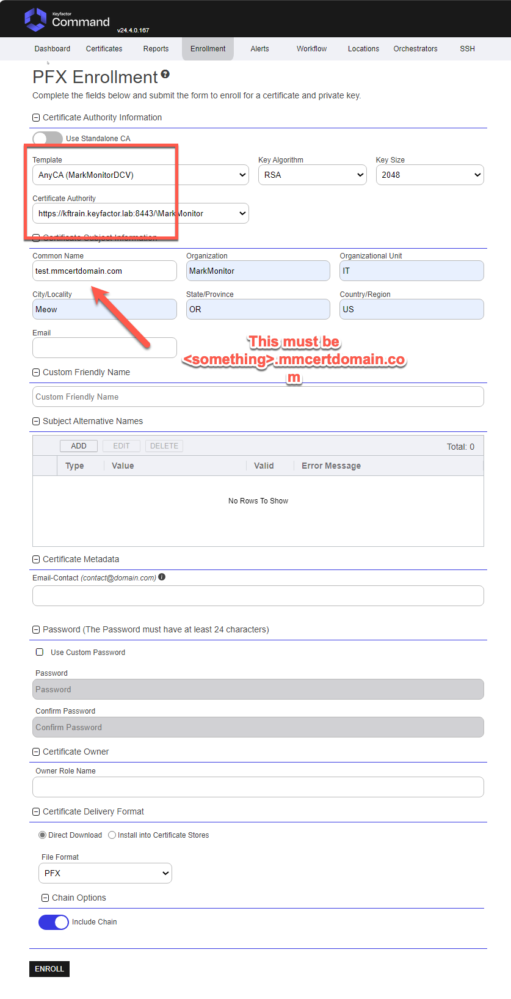
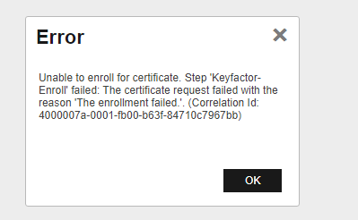
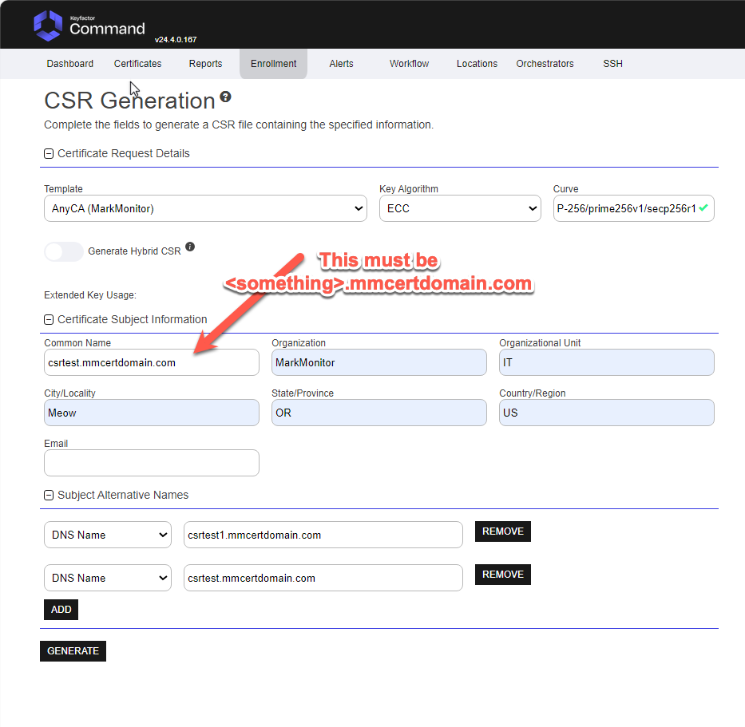
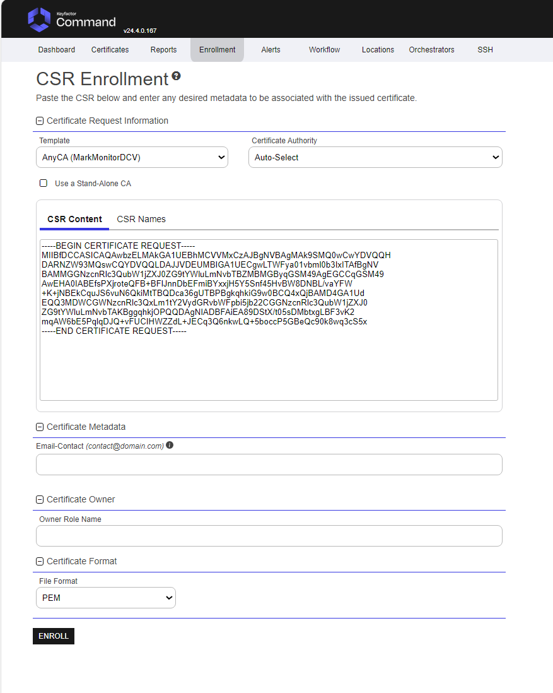
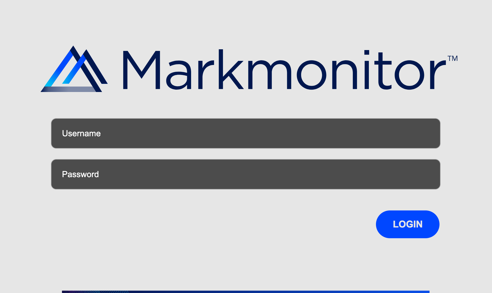
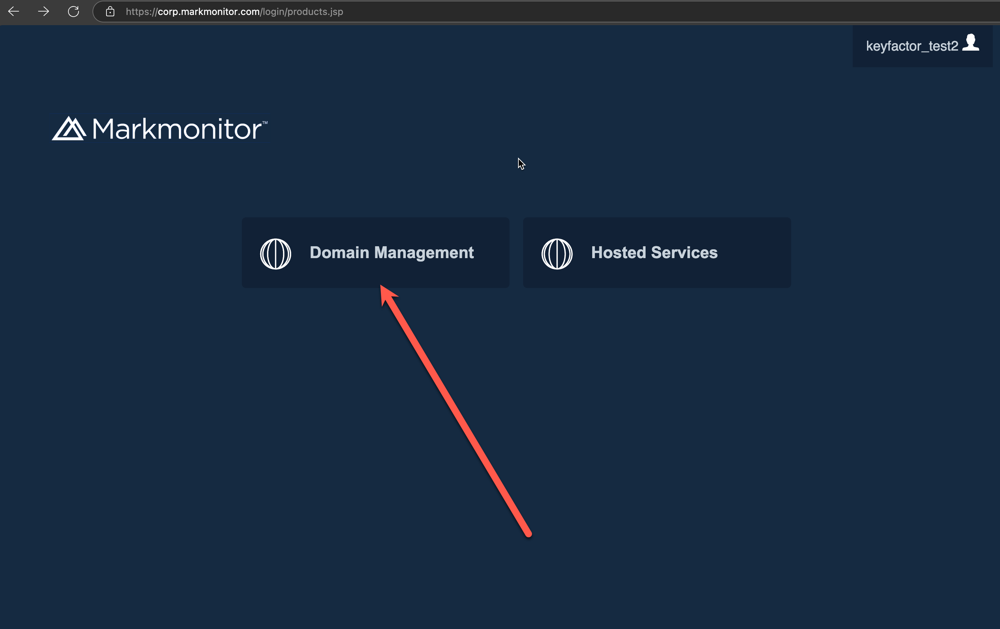
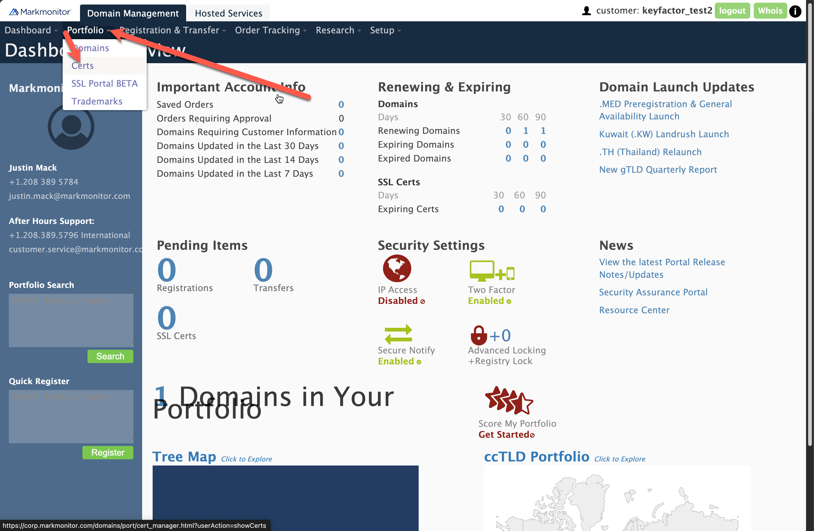
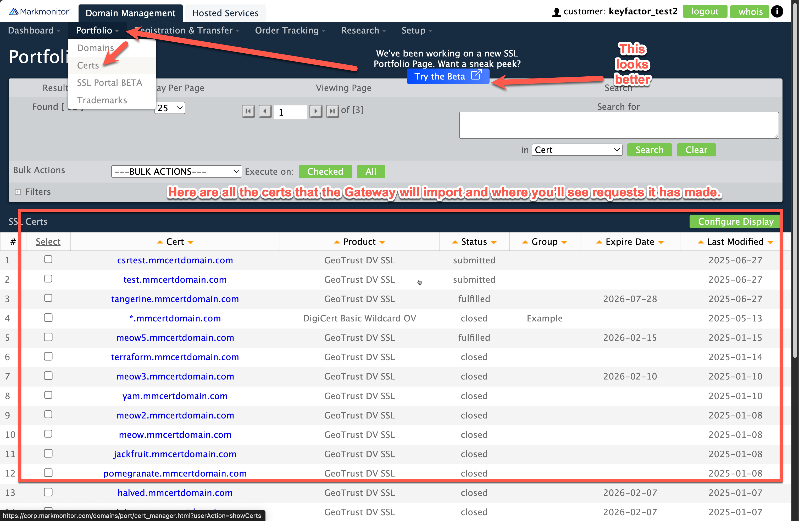
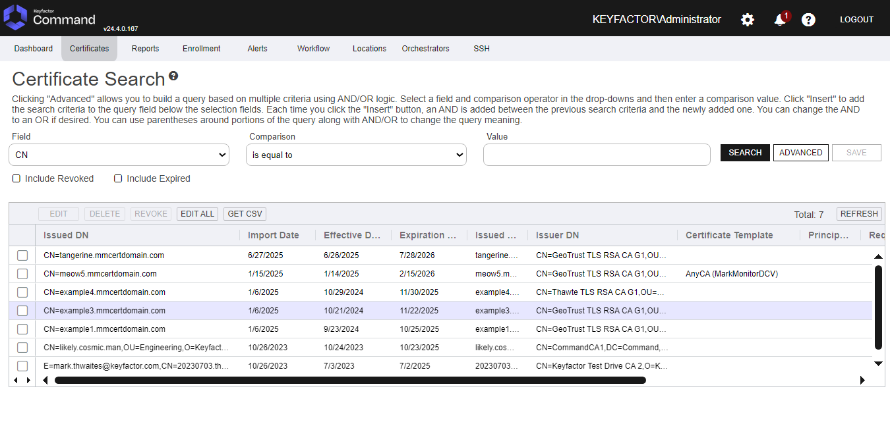
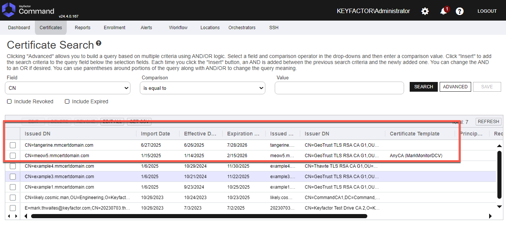

# Enrolling Certificates Using the MarkMonitor AnyCA Gateway
This will guide you through the process of enrolling certificates using the Markmonitor AnyCA Gateway in Keyfactor Command.

> [!IMPORTANT]
> THIS DOCUMENTATION IS NOT MEANT FOR END USERS. It is meant for Keyfactor internal testing.

> [!IMPORTANT]
> Enrollments will FAIL due to the fact that email verification is required to complete the cert order flow. Once approved, 
> the certificate will be available in Keyfactor Command on the next incremental CA sync.

## PFX Enrollment
Example PFX Enrollment

> [!IMPORTANT]
> Enrollments will FAIL due to the fact that email verification is required to complete the cert order flow. Once approved,
> the certificate will be available in Keyfactor Command on the next incremental CA sync.

### CSR Enrollment

#### Generate CSR

#### Enroll CSR
> [!IMPORTANT]
> The `common name` must be `<something>.mmcertdomain.com` of the request will be rejected by Markmonitor.

> [!IMPORTANT]
> An ECC CSR must use a named curve (e.g. P-256/secp256r1), not explicit curve parameters. MarkMonitor
> rejects a CSR using explicit parameters silently - the order reaches a failed status almost
> immediately, with no reason surfaced anywhere in its API, history, or order details. The plugin
> validates this at enrollment time and rejects such a CSR with an explicit error rather than
> submitting an order that will fail invisibly. If you see this behavior when generating your own
> CSR (rather than through the plugin), check that your CSR-generation tooling encodes the curve by
> OID reference rather than spelling out its parameters (`openssl req -in your.csr -noout -text` will
> show `ASN1 OID: prime256v1` for a compliant CSR, versus explicit `Prime:`/`A:`/`B:`/`Generator:`
> fields for one that will fail).

> [!IMPORTANT]
> Enrollments will FAIL due to the fact that email verification is required to complete the cert order flow. Once approved,
> the certificate will be available in Keyfactor Command on the next incremental CA sync.

## View Certs in MarkMonitor
https://corp.markmonitor.com/login/extjs/index.html

## View Certs in Keyfactor Command

## Certificate Approvals

Due to the way MarkMonitor set up Keyfactor for testing, the certificate approvals will need to be done manually 
through email verifications.

> [!IMPORTANT]
> Currently only sean.bailey@keyfactor.com is set up to receive the email approvals.

